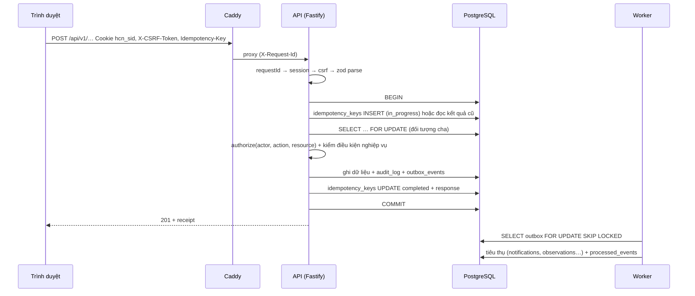

# 02 · Kiến trúc hệ thống

## 1 Quyết định nền

| Mã | Quyết định | Lý do |
|---|---|---|
| ADR-301 | Monorepo pnpm, một backend modular monolith (API + worker cùng mã domain) | Giao dịch review–hồ sơ đơn giản; ít dịch vụ để vận hành trên một VPS |
| ADR-302 | PostgreSQL là nguồn dữ liệu chuẩn duy nhất; không Redis ở pilot | Outbox, phiên, idempotency, hàng đợi đều chạy tốt trên Postgres ở quy mô một trường |
| ADR-303 | Backend-for-frontend: trình duyệt chỉ có cookie phiên; token OIDC ở server | Giảm rủi ro XSS lấy token; thu hồi quyền tức thì |
| ADR-304 | Zod trong `packages/contracts` là nguồn schema; OpenAPI sinh từ zod và so với `openapi/openapi.yaml` trong CI | Một nguồn cho validate runtime, kiểu TS và tài liệu |
| ADR-305 | Kysely thay ORM | SQL tường minh, kiểu sinh từ DB, kiểm soát transaction và khóa hàng |
| ADR-306 | Migration SQL thuần bằng dbmate | Trigger, EXCLUDE, role DB viết trực tiếp; không phụ thuộc ORM |
| ADR-307 | Web là SPA tĩnh do Caddy phục vụ | Không cần SSR; triển khai đơn giản; tách hẳn khỏi API |
| ADR-308 | Worker poll outbox bằng `FOR UPDATE SKIP LOCKED` | Không cần message broker; đảm bảo ít nhất một lần + idempotent consumer |

## 2 Phiên bản ghim

Ghim **major** ở đây; phiên bản chính xác khóa bằng `pnpm-lock.yaml` và digest image. Kiểm bản vá bảo mật hằng tháng.

| Thành phần | Phiên bản | Ghi chú |
|---|---|---|
| Node.js | 26.x (LTS từ 10/2026) | Nếu khởi động trước khi 26 vào LTS: dùng 24.x rồi nâng ở mốc M10 |
| pnpm | 10.x | `packageManager` trong package.json |
| TypeScript | 5.x | `strict`, `noUncheckedIndexedAccess`, `exactOptionalPropertyTypes` |
| Fastify | 5.x | kèm `@fastify/cookie`, `@fastify/helmet`, `@fastify/rate-limit`, `@fastify/multipart`, `@fastify/swagger` |
| zod | 4.x | `fastify-type-provider-zod` tương thích |
| Kysely | 0.28.x | `kysely-codegen` sinh kiểu |
| pg | 8.x | pool riêng cho API và worker |
| openid-client | 6.x | Authorization Code + PKCE |
| React | 19.2.x | |
| Vite | 8.x | |
| React Router | 7.x | chế độ data router |
| TanStack Query | 5.x | |
| PostgreSQL | 18.x | image `postgres:18` |
| Keycloak | 26.x | image `quay.io/keycloak/keycloak:26.7` |
| Caddy | 2.x | HTTPS tự động |
| ClamAV | 1.4.x | clamd qua TCP |
| dbmate | 2.x | |
| Vitest | 3.x | |
| Playwright | 1.5x | |
| k6 | 1.x | |

Thư viện được phép thêm không cần hỏi: `pino` (log), `ulid`/`uuid`, `date-fns` + `date-fns-tz`, `sanitize-html` (server), `file-type`, `clamscan`, `@testcontainers/postgresql`, `@axe-core/playwright`. Mọi thư viện khác cần đồng ý.

## 3 Cấu trúc repo

```
hoc-cung-nhau/
├─ AGENTS.md
├─ .cursor/rules/*.mdc
├─ package.json            # scripts gốc: dev, test, verify…
├─ pnpm-workspace.yaml
├─ apps/
│  ├─ api/                 # Fastify: plugins/, routes/, server.ts, main.ts
│  ├─ worker/              # main.ts, consumers/<event>.ts, jobs/ (dọn phiên, idempotency)
│  └─ web/                 # Vite: src/routes, src/features, src/ui, src/i18n
├─ packages/
│  ├─ contracts/           # zod schema request/response, mã lỗi, enum
│  ├─ domain/              # use case theo module, policies, errors, pure functions (r0, coverage, grading)
│  ├─ db/                  # kysely instance, schema.ts (sinh), repositories/
│  └─ testkit/             # factories, personas, testcontainers helper, authz matrix
├─ db/
│  ├─ migrations/          # dbmate
│  ├─ seeds/               # curriculum_requirements.json + script nạp
│  └─ tests/               # schema_invariants.sql
├─ openapi/openapi.yaml    # hợp đồng đã duyệt; CI so với bản sinh
├─ e2e/                    # Playwright
├─ perf/                   # k6
├─ deploy/                 # compose.yml, compose.dev.yml, Caddyfile, keycloak realm, scripts
└─ docs/
```

## 4 Module domain

Mỗi module là một thư mục trong `packages/domain/src/`. Module khác chỉ gọi qua hàm export trong `index.ts` của module đó.

| Module | Sở hữu bảng | Use case chính |
|---|---|---|
| `identity` | users, sessions, school_memberships | resolveUserFromOidc, listContexts, switchContext |
| `org` | schools, academic_years, admin_classes, class_memberships, courses, offerings, offering_class_links, teacher_assignments, offering_enrollments, guardian_links | createOffering, assignTeacher, enrollLearners, requestGuardianLink, verifyGuardianLink, revokeGuardianLink, transferClass |
| `curriculum` | subjects, curriculum_requirements, knowledge_components, kc_versions, requirement_kc_links, kc_edges, misconceptions | importRequirements, reviewRequirement, proposeKc, approveKcVersion, proposeEdge, approveEdge |
| `authoring` | modules, module_collaborators, module_drafts, module_versions, module_items, assessment_versions, question_items, question_keys, question_kc_links, option_misconceptions, rubric_versions, rubric_criteria | createModule, saveDraft, validateDraft (coverage), publishModuleVersion |
| `release` | path_releases, module_releases, release_schedule_changes | releaseModules, changeSchedule |
| `learning` | activity_progress, submissions, submission_versions, submission_version_files, files | markPageViewed, selfMark, saveSubmissionDraft, submitAssignment, uploadFile |
| `quiz` | quiz_attempts, question_responses | startAttempt, answerQuestion (practice), requestHint, submitAttempt |
| `review` | reviews, review_criterion_results, attainment_decisions | openReview, saveReviewDraft, publishReview, supersedeDecision |
| `insight` | observations, needs_estimates, misconception_signals | (worker) deriveObservations, recomputeNeeds, updateMisconceptionSignals; (API đọc) getNeeds, getHeatmap |
| `family` | family_supports | commitSupport, cancelSupport |
| `notify` | notifications | (worker) notifyOnEvent; markRead |
| `platform` | idempotency_keys, outbox_events, processed_events, audit_log | withIdempotency, writeOutbox, audit |

## 5 Vòng đời một request ghi



Idempotency chi tiết:

1. `request_hash = sha256(method + path + canonicalJson(body))`.
2. `INSERT … ON CONFLICT (actor_id, scope, key) DO NOTHING RETURNING *`. Nếu không chèn được: đọc hàng cũ.
   - `completed` + cùng hash → trả nguyên `response_status`, `response_body`.
   - Khác hash → 409 `IDEMPOTENCY_KEY_REUSED`.
   - `in_progress` → 409 `REQUEST_IN_PROGRESS` (client thử lại sau 1 giây).
3. Hàng idempotency nằm **trong cùng transaction** với dữ liệu nghiệp vụ; nếu transaction rollback thì hàng cũng biến mất và client thử lại được.

## 6 Xác thực và phiên

Luồng OIDC (Keycloak realm `hcn`, client `hcn-web` loại confidential, chỉ Authorization Code + PKCE):

1. `GET /auth/login?returnTo=/…` → server tạo `state`, `nonce`, `code_verifier`, lưu trong cookie tạm `hcn_oidc` (ký HMAC, HttpOnly, 10 phút) → 302 tới Keycloak.
2. `GET /auth/callback` → kiểm `state`, đổi code lấy token, kiểm `iss`, `aud`, `nonce`, chữ ký, `exp` → tìm `users` theo `(iss, sub)`. Không tự tạo người dùng: nếu chưa có hàng `users` thì trả trang "Tài khoản chưa được nhà trường cấp quyền" (mục 6.1).
3. Tạo phiên: token ngẫu nhiên 32 byte base64url → cookie `hcn_sid` (HttpOnly, Secure, SameSite=Lax, Path=/, không Domain); DB lưu `sha256(token)`, `csrf_token` ngẫu nhiên, `expires_at = now + 12h`, trượt khi hoạt động nhưng tối đa 7 ngày từ `created_at`.
4. `POST /auth/logout` → thu hồi phiên, xóa cookie, chuyển tới end-session của Keycloak với `id_token_hint`.

CSRF: mọi request không an toàn phải có header `X-CSRF-Token` khớp `sessions.csrf_token` **và** header `Origin` khớp `APP_ORIGIN`. Web lấy `csrfToken` từ `GET /api/v1/me`.

Ngữ cảnh: `sessions.context = {school_id, role}`. `POST /api/v1/me/context` chỉ nhận cặp có trong `school_memberships` đang active. Mọi use case vẫn kiểm quan hệ cụ thể; ngữ cảnh chỉ để chọn giao diện và mặc định lọc.

Khóa tài khoản hoặc thu hồi quan hệ có hiệu lực ở request tiếp theo vì quyền đọc từ DB mỗi request (có thể cache trong request, không cache giữa các request).

### 6.1 Cấp tài khoản

Nhiều học sinh không có email, nên tài khoản do nhà trường cấp:

- Quản trị trường tải lên CSV (`ho_ten, ma_dinh_danh, vai_tro, lop, email?`). API gọi Keycloak Admin REST bằng service account `hcn-provisioner` (client credentials, chỉ role `manage-users` của realm `hcn`) để tạo người dùng với `username = ma_dinh_danh` và mật khẩu tạm bắt buộc đổi ở lần đăng nhập đầu.
- Ngay sau khi Keycloak trả `id`, API tạo hàng `users(oidc_issuer, oidc_subject = id)` và `school_memberships` trong cùng use case. Nếu bước DB lỗi, gọi Keycloak xóa người dùng vừa tạo (bù trừ) và ghi audit.
- Mật khẩu tạm chỉ hiển thị một lần trên phiếu in cho GVCN; không lưu trong DB, không ghi log.
- Phụ huynh được cấp tương tự; liên kết với con tạo ở trạng thái `pending` và chỉ `verified` khi quản trị xác minh.

## 7 Phân quyền

`packages/domain/src/*/policies.ts` chứa hàm thuần:

```ts
type Actor = { userId: string; schoolId: string; roles: Role[] };
type Decision = { allow: true } | { allow: false; reason: 'NOT_MEMBER' | 'NOT_ASSIGNED' | 'NOT_ENROLLED' | 'NOT_LINKED' | 'NOT_PUBLISHED' | 'CAPABILITY_MISSING' };
function can(actor: Actor, action: Action, facts: Facts): Decision
```

`facts` do repository nạp (ví dụ: GV có phân công còn hiệu lực cho offering X với capability `review` không). Ma trận hành động đầy đủ ở docs/05 mục 2. Khi từ chối đối tượng tồn tại nhưng không có quyền, trả **404** (không tiết lộ tồn tại) với dữ liệu của HS/PH; trả **403** cho thao tác quản trị trong trường mà actor là thành viên.

## 8 Lỗi và mã lỗi

| HTTP | code | Khi nào |
|---|---|---|
| 400 | `BAD_REQUEST` | JSON hỏng, thiếu header bắt buộc |
| 401 | `UNAUTHENTICATED` | Không có phiên hoặc hết hạn |
| 403 | `FORBIDDEN`, `CSRF_FAILED` | Không có quyền; CSRF sai |
| 404 | `NOT_FOUND` | Không tồn tại hoặc không được thấy |
| 409 | `REVISION_CONFLICT`, `IDEMPOTENCY_KEY_REUSED`, `REQUEST_IN_PROGRESS`, `SUBMISSION_VERSION_CHANGED`, `ALREADY_PUBLISHED`, `ATTEMPT_LIMIT_REACHED`, `ALREADY_ANSWERED` | Xung đột trạng thái |
| 410 | `RELEASE_CLOSED` | Quá `accept_until` hoặc late_policy = reject sau hạn |
| 413 | `FILE_TOO_LARGE` | > 25 MiB |
| 415 | `FILE_TYPE_NOT_ALLOWED` | MIME thật ngoài allowlist |
| 422 | `VALIDATION_FAILED`, `COVERAGE_BLOCKED`, `FEATURE_NOT_ENABLED`, `KC_EDGE_CYCLE` | Dữ liệu không hợp lệ; V01/V05/V07 chặn publish; duyệt cạnh tạo chu trình |
| 423 | `FILE_NOT_SCANNED` | Tệp chưa quét xong khi nộp |
| 429 | `RATE_LIMITED` | Vượt giới hạn |
| 500 | `INTERNAL` | Lỗi không lường trước; không kèm chi tiết |

Body: `{"error":{"code":"…","message":"thông điệp tiếng Việt cho người dùng","request_id":"…","details":{…}}}`.

## 9 Log, đo lường, audit

- `pino` JSON một dòng; trường bắt buộc: `time`, `level`, `request_id`, `route`, `status`, `duration_ms`, `actor_id` (uuid, không tên), `school_id`.
- Redact: `req.headers.cookie`, `authorization`, `x-csrf-token`, mọi trường `body`, `text`, `comment`, `reflection`.
- Metrics Prometheus tại `/metrics` chỉ nghe trên mạng nội bộ: HTTP histogram, pool DB, `outbox_pending`, `outbox_dead`, `files_pending_scan`, `last_backup_age_seconds` (do script backup ghi).
- Audit: mọi use case ghi gọi `audit(trx, {action, objectType, objectId, details})`. `details` chỉ chứa ID và trạng thái, không nội dung bài.

## 10 Cấu hình (biến môi trường)

| Biến | Ví dụ | Dùng ở |
|---|---|---|
| `APP_ORIGIN` | `https://hoc.truong.edu.vn` | API (CSRF, redirect) |
| `DATABASE_URL` | `postgres://hcn_api:…@db:5432/hcn` | API |
| `WORKER_DATABASE_URL` | `postgres://hcn_worker_login:…@db:5432/hcn` | Worker |
| `OIDC_ISSUER` | `https://id.truong.edu.vn/realms/hcn` | API |
| `OIDC_CLIENT_ID`, `OIDC_CLIENT_SECRET` | `hcn-web`, secret file | API |
| `SESSION_TTL_HOURS`, `SESSION_MAX_DAYS` | `12`, `7` | API |
| `COOKIE_SECRET` | 32 byte | API (ký cookie tạm OIDC) |
| `FILE_STORAGE_DIR` | `/data/files` | API, worker |
| `CLAMAV_HOST`, `CLAMAV_PORT` | `clamav`, `3310` | Worker |
| `TZ_DISPLAY` | `Asia/Ho_Chi_Minh` | Web, API |
| `FEATURE_FLAGS` | `insight_read=true,ai=false` | API |

Bí mật đọc từ Docker secrets (`/run/secrets/*`), không để trong image hay git.
