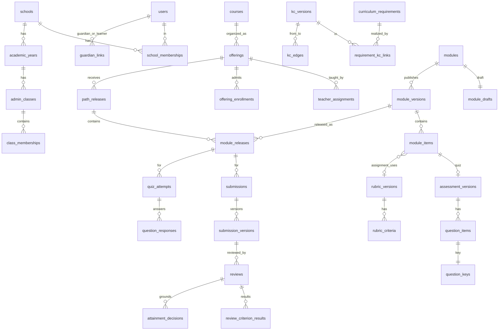

# 03 · Mô hình dữ liệu

Nguồn chuẩn: `db/migrations/*.sql`. Tài liệu này giải thích ý nghĩa, các định dạng JSON và quy tắc dùng. Khi hai nơi khác nhau, **migration thắng**; sửa tài liệu cho khớp.

## 1 Nhóm bảng



| Nhóm | Bảng | Ghi chú |
|---|---|---|
| Tổ chức | schools, users, school_memberships, academic_years, admin_classes, class_memberships, guardian_links, courses, offerings, offering_class_links, teacher_assignments, offering_enrollments | Lớp hành chính tách lớp môn; quyền theo quan hệ |
| Chương trình (quốc gia) | subjects, curriculum_requirements, knowledge_components, kc_versions, requirement_kc_links, kc_edges, misconceptions, curriculum_reviewers | Không có `school_id`; người có dòng `curriculum_reviewers` theo môn mới được duyệt (M3) |
| Nội dung | modules, module_collaborators, module_drafts, module_versions, module_items, assessment_versions, question_items, question_keys, question_kc_links, option_misconceptions, rubric_versions, rubric_criteria | Nháp sửa được; phiên bản bất biến |
| Giao bài | path_releases, module_releases, release_schedule_changes | `module_release_id` là scope của tiến độ, bài nộp, quiz |
| Học tập | activity_progress, submissions, submission_versions, submission_version_files, files, quiz_attempts, question_responses, attempt_hint_usage | Tiến độ tách khỏi mức đạt |
| Hồ sơ | reviews, review_criterion_results, attainment_decisions (+ view attainment_current) | Chỉ `publishReview` và `supersedeDecision` ghi quyết định |
| Nền AI | observations, needs_estimates (+ view needs_current), misconception_signals, ai_proposals | Worker ghi; không có quyền với bảng quyết định |
| Gia đình, thông báo | family_supports, notifications | |
| Hạ tầng | sessions, idempotency_keys, outbox_events, processed_events, audit_log | |

## 2 Bất biến được DB cưỡng chế

Đã có ca kiểm thử trong `db/tests/schema_invariants.sql` (DB01–DB16, chạy trong CI).

| Bất biến | Cơ chế | Ca |
|---|---|---|
| Một lớp hành chính tại một thời điểm/năm | EXCLUDE gist | DB01 |
| Không liên kết chéo trường | FK ghép `(id, school_id)` | DB02 |
| Mã 791 khớp môn và lớp | CHECK | DB03 |
| Đồ thị tiên quyết đã duyệt là DAG | trigger `kc_edges_no_cycle` + LOCK | DB04 |
| Nội dung KC version, module version, mục, câu hỏi, khóa, rubric, phiên bản bài nộp, quan sát, quyết định, audit bất biến | trigger `forbid_mutation` / guard | DB05, DB06, DB08b, DB10 |
| Completion hợp lệ theo loại mục (Module 3.2.1) | CHECK | DB06b |
| Câu AI soạn phải có người duyệt | CHECK | DB07 |
| Một bài nộp cho mỗi HS × release × mục | UNIQUE | DB08 |
| Quyết định mức đạt dựa trên review đã công bố | constraint trigger DEFERRABLE | DB09 |
| Chuỗi thay thế quyết định tuyến tính, có lý do | UNIQUE partial + CHECK | DB11 |
| Quan sát idempotent theo nguồn | UNIQUE (source_ref, kc_version_id) | DB12 |
| Thông báo không trùng | UNIQUE (recipient_id, source_event) | DB13 |
| Liên kết PH hợp lệ | CHECK + UNIQUE partial | DB14 |
| Worker không đọc khóa, không ghi quyết định/giao bài | GRANT theo role | DB15 |
| Tệp ≤ 25 MiB | CHECK | DB16 |

Bất biến **không** thể cưỡng chế bằng DB, phải có test use case: phân quyền theo quan hệ (INV-02, INV-03), DTO không chứa khóa (INV-06), idempotency theo body (INV-07), revision (INV-09).

## 3 Role DB và kết nối

| Tài khoản đăng nhập | Thuộc role | Dùng cho |
|---|---|---|
| `hcn_owner` | chủ schema | Chỉ chạy migration (dbmate) |
| `hcn_api` | `hcn_app` | API |
| `hcn_worker_login` | `hcn_worker` | Worker |
| `hcn_report` | `hcn_readonly` | Truy vấn báo cáo thủ công |

Migration tạo role nhóm; `deploy/postgres/init.sh` tạo tài khoản đăng nhập với mật khẩu từ secret. Migration về sau tạo bảng mới phải GRANT lại cho các role (thêm câu `GRANT` trong chính migration đó).

## 4 Định dạng JSON

Mọi JSON có schema zod trong `packages/contracts/src/json/`. Server validate khi ghi.

### 4.1 `module_drafts.payload` (ModuleDraft v1)

```json
{
  "schema": "module-draft/1",
  "title": "Lập trình cơ bản: rẽ nhánh và lặp",
  "description": "…",
  "requirementIds": ["uuid-140110.0601a", "uuid-140110.0603b"],
  "items": [
    { "clientKey": "i1", "type": "header", "title": "Mục tiêu", "indent": 0, "completion": "none" },
    { "clientKey": "i2", "type": "page", "title": "Rẽ nhánh if–else", "body": {"format":"hcn-rich/1","blocks":[…]}, "completion": "view" },
    { "clientKey": "i3", "type": "quiz", "title": "Luyện tập", "completion": "submit",
      "assessment": { "purpose": "practice", "maxAttempts": null, "showFeedback": "immediate", "hintsEnabled": true, "shuffleOptions": false,
        "questions": [
          { "clientKey": "q1", "qtype": "single_choice", "stem": {"format":"hcn-rich/1","blocks":[…]},
            "options": [{"id":"a","label":"3.5"},{"id":"b","label":"3"},{"id":"c","label":"4"}],
            "answerKey": {"option":"b"}, "rationale": {…},
            "kcRequired": ["kcv-uuid-io"], "kcObservable": ["kcv-uuid-toantu"], "bloomTarget": 3,
            "variantGroup": "tin10-chianguyen-01", "difficultyPrior": "medium",
            "hints": ["Phép // khác phép / ở điểm nào?", "// chia rồi bỏ phần thập phân"],
            "optionMisconceptions": {"a": "misc-uuid-M-TIN10-01"},
            "source": "teacher" } ] } },
    { "clientKey": "i4", "type": "assignment", "title": "Chương trình tính tiền điện", "completion": "submit",
      "body": {…}, "requirementIds": [...],
      "rubric": { "title": "Rubric tiền điện", "criteria": [
        { "title": "Rẽ nhánh theo bậc giá", "kcVersionId": "kcv-uuid-if",
          "levels": { "meets": "…", "developing": "…", "notYet": "…" } } ] } },
    { "clientKey": "i5", "type": "link", "title": "Tài liệu tham khảo", "url": "https://…", "completion": "none" }
  ]
}
```

`clientKey` là định danh ổn định trong bản nháp (giữ khi đổi thứ tự); `answerKey` chỉ có trong bản nháp của GV và bảng `question_keys`, không bao giờ trong DTO học sinh.

### 4.2 Rich text `hcn-rich/1`

Khối cho phép: `paragraph`, `heading` (2–4), `list` (ordered/bullet), `code` (language: python, sql, html, css, text), `math` (LaTeX, hiển thị bằng KaTeX phía client), `image` (fileId + alt bắt buộc), `table` (tối đa 10×10), `callout`. Inline: bold, italic, code, link (https). Server từ chối khối lạ; không lưu HTML thô.

### 4.3 `submission_versions.body`

```json
{ "type": "code", "language": "python", "text": "…", "testCases": [ {"input":"30","expected":"59520","actual":"59520","note":""} ] }
{ "type": "text", "text": "…" }
{ "type": "rich", "doc": {"format":"hcn-rich/1","blocks":[…]} }
```

Giới hạn: `text` ≤ 100 000 ký tự; `testCases` ≤ 30.

### 4.4 Đáp án `question_keys.key` và câu trả lời `question_responses.response`

| qtype | key | response |
|---|---|---|
| single_choice | `{"option":"b"}` | `{"option":"b"}` |
| multi_choice | `{"options":["a","c"],"scoring":"all_or_nothing"}` hoặc `"partial"` | `{"options":["a","c"]}` |
| numeric | `{"value":"5/6","tolerance":"0","accept":["0,8333"],"unit":null}` | `{"raw":"5/6","normalized":"0.833333"}` |
| short_text | `{"accept":["WHERE"],"caseSensitive":false}` hoặc `{"manual":true}` | `{"raw":"where"}` |

Chuẩn hóa số: chấp nhận dấu phẩy thập phân kiểu Việt Nam (`0,5`), dấu chấm (`2.5`), phân số `a/b`, số âm có dấu `−` (U+2212) hoặc `-`. Chuỗi không phân tích được hoặc nhập nhằng như `1.000` → 422, không chấm sai (INV-12). Hàm `normalizeNumber` có vector kiểm thử ở docs/06.

## 5 Chỉ mục ban đầu và truy vấn nóng

| Truy vấn | Chỉ mục |
|---|---|
| HS: việc cần làm hôm nay | `offering_enrollments_learner_idx`, `module_releases_offering_idx` |
| GV: hàng chờ chấm | `submissions_queue_idx` |
| Hồ sơ HS theo YCCĐ | `attainment_decisions_learner_idx` |
| Nhu cầu hiện tại | `needs_estimates_latest_idx` |
| Worker outbox | `outbox_pending_idx` |
| Hộp thông báo | `notifications_inbox_idx` |

Kiểm `EXPLAIN (ANALYZE, BUFFERS)` với dữ liệu tổng hợp 1 trường × 1 200 HS × 40 offering × 30 module trước M9.

## 6 Lưu giữ và xóa

| Dữ liệu | Giữ | Cách xóa |
|---|---|---|
| sessions hết hạn | 30 ngày | job hằng ngày |
| idempotency_keys | 7 ngày | job hằng ngày |
| outbox_events done | 30 ngày | job; `dead` giữ tới khi xử lý tay |
| audit_log | theo chính sách trường (đề xuất 5 năm) | chuyển sang partition theo năm ở M10; không DELETE từng dòng |
| Bài nộp, review, quyết định | theo chính sách trường | quy trình xóa theo yêu cầu có phê duyệt, ghi audit; không có nút xóa trong UI |
| Tệp | cùng bài nộp | chỉ xóa vật lý sau khi hết cửa sổ sao lưu |

Chính sách lưu giữ cụ thể do nhà trường quyết định theo Luật Bảo vệ dữ liệu cá nhân 2025 và văn bản hướng dẫn; cấu hình trước khi nhập dữ liệu thật.

## 7 Nạp seed

`pnpm db:seed:curriculum` đọc `db/seeds/curriculum_requirements.json` (hoặc bản rút gọn `curriculum_requirements.csv` với các cột `code791, extraction, flags, text, source_doc`; các trường môn, lớp, đơn vị, Bloom suy ra từ `code791` theo Phụ lục V):

- Upsert `subjects`.
- Upsert `curriculum_requirements` theo `code791_stem`; **không ghi đè** hàng đã `approved`.
- Hàng có `extraction = "check"` được nạp với `review_status = 'unverified'` và hiện trong hàng đợi thẩm định (M3).
- Script idempotent; chạy hai lần không đổi dữ liệu. Có test.

Đã chạy thử: 280 hàng (Tin 10: 39, Tin 11: 53, Tin 12: 36, Toán 7: 65, Toán 10: 87) nạp được vào schema; 19 hàng Toán có cờ `check`.
