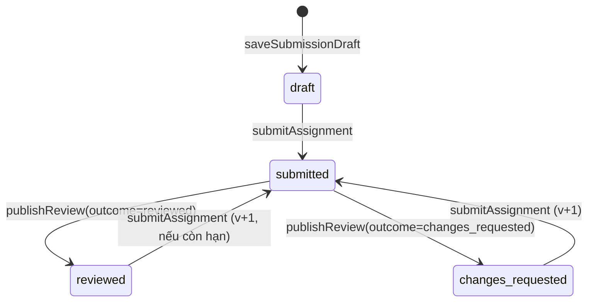
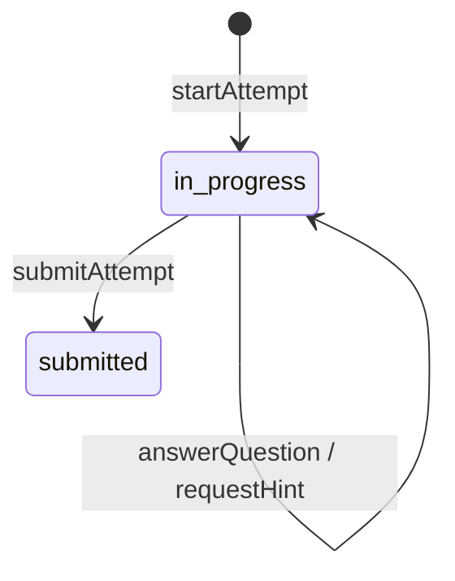

# 05 · Nghiệp vụ và lệnh ghi

Mỗi lệnh ghi là một use case trong `packages/domain`. Mục này là **đặc tả để code**: ai được làm, điều kiện, các bước trong giao dịch, sự kiện phát ra, lỗi, và ca kiểm thử bắt buộc. Đọc cùng docs/02 mục 5 (vòng đời request) và docs/06 (chấm, quan sát, R0).

Ký hiệu: **Khóa** = `SELECT … FOR UPDATE`; **Audit** = ghi `audit_log`; **Outbox** = ghi `outbox_events`. Mọi lệnh có Audit trừ khi ghi "không audit".

## 1 Sự kiện outbox

| event_type | Phát bởi | Payload (chỉ ID) | Consumer |
|---|---|---|---|
| `ReleaseCreated` | releaseModules | pathReleaseId, moduleReleaseIds, offeringId | notify (HS trong offering) |
| `SubmissionSubmitted` | submitAssignment | submissionId, submissionVersionId, learnerId, moduleReleaseId | notify (GV phân công, gộp theo giờ) |
| `QuestionAnswered` | answerQuestion, submitAttempt | responseIds, attemptId, learnerId, offeringId, purpose | insight.deriveObservations |
| `ReviewPublished` | publishReview | reviewId, submissionId, learnerId, offeringId, decisionIds | notify (HS, PH đã xác minh); insight.deriveObservations |
| `DecisionSuperseded` | supersedeDecision | decisionId, learnerId, offeringId | notify (HS) |
| `FileUploaded` | uploadFile | fileId | files.scan |
| `ObservationsAdded` | insight.deriveObservations (worker) | learnerId, offeringId, kcVersionIds | insight.recomputeNeeds, insight.updateMisconceptionSignals |
| `GuardianLinkRevoked` | revokeGuardianLink | linkId | platform.revokeGuardianSessionsCache (không có cache ở pilot: no-op) |

Consumer đánh dấu `processed_events(event_id, consumer)` trong cùng transaction với tác dụng của nó.

## 2 Ma trận quyền

`can(actor, action, facts)`; "phân công" = `teacher_assignments` còn hiệu lực có capability tương ứng; "ghi danh" = `offering_enrollments.status='active'`; "liên kết" = `guardian_links.status='verified'`.

| Hành động | admin | teacher | student | guardian |
|---|---|---|---|---|
| `org.manage` (offering, phân công, ghi danh, nhập tài khoản) | ✓ trong trường | ✗ | ✗ | ✗ |
| `guardian_link.verify/revoke` | ✓ trong trường | ✗ | ✗ | ✗ |
| `curriculum.read` | ✓ | ✓ | ✓ (YCCĐ của offering đã ghi danh) | ✓ (của con) |
| `curriculum.propose` | ✗ | ✓ | ✗ | ✗ |
| `curriculum.review` | có dòng `curriculum_reviewers` cho môn | như admin | ✗ | ✗ |
| `module.create/edit` | ✗ | chủ module hoặc collaborator editor; course có offering được phân công `author` | ✗ | ✗ |
| `module.publish` | ✗ | như edit | ✗ | ✗ |
| `release.create/change` | ✗ | phân công `release` cho offering | ✗ | ✗ |
| `release.read_learner` | ✗ | phân công bất kỳ (xem trước, không sinh tiến độ) | ghi danh + `available_from ≤ now` | ✗ |
| `progress.write` | ✗ | ✗ | chính mình, ghi danh | ✗ |
| `submission.draft/create` | ✗ | ✗ | chính mình, ghi danh, release mở | ✗ |
| `submission.read` | ✗ (M10: quyền hỗ trợ có lý do) | phân công `review` hoặc `view` | chính mình | ✗ nội dung; ✓ tiêu đề và trạng thái của con |
| `attempt.*` | ✗ | ✗ | chính mình | ✗ |
| `review.*` | ✗ | phân công `review` | ✗ | ✗ |
| `review.read_published` | ✗ | phân công | chính mình | liên kết |
| `decision.supersede` | ✗ | phân công `review` | ✗ | ✗ |
| `needs.read` | ✗ | phân công (có value) | chính mình (nhãn chữ) | ✗ |
| `heatmap.read` | ✗ | phân công | ✗ | ✗ |
| `family_support.*` | ✗ | ✗ | ✗ | liên kết |

Test: `packages/testkit/authz/matrix.ts` sinh ca cho mọi ô (cho phép và từ chối) trên dữ liệu hai trường, hai offering, hai HS, hai PH (docs/09 mục 4).

## 3 Tổ chức

### 3.1 importUsers

- **Quyền** `org.manage`. **Idempotency** có (scope `importUsers:<schoolId>`).
- **Input** CSV UTF-8, tối đa 2 000 dòng: `ho_ten, ma_dinh_danh, vai_tro (student|teacher|guardian), lop?, email?, ma_hs_con?` (với guardian).
- **Kiểm** trùng `ma_dinh_danh` trong tệp; vai trò hợp lệ; lớp tồn tại trong năm học hiện hành.
- **Các bước** theo lô 50 dòng: tạo người dùng Keycloak (mật khẩu tạm 12 ký tự, `requiredActions=[UPDATE_PASSWORD]`) → transaction: `users`, `school_memberships`, `class_memberships` (nếu có lớp), `guardian_links` pending (nếu guardian có `ma_hs_con`), Audit. Lỗi DB → xóa người dùng Keycloak vừa tạo.
- **Output** danh sách tạo được kèm mật khẩu tạm (chỉ trả một lần) và danh sách lỗi theo dòng. Không ghi mật khẩu vào log hay audit.
- **Test** tệp có dòng trùng; Keycloak lỗi giữa lô; chạy lại cùng key không tạo trùng.

### 3.2 createOffering, assignTeacher, enrollLearners

- `createOffering`: kiểm course và năm học thuộc trường; `code` duy nhất trong năm; tùy chọn tạo `offering_class_links`.
- `assignTeacher`: người được phân công có membership `teacher` active. EXCLUDE chặn phân công chồng thời gian → 409.
- `enrollLearners`: chỉ người có membership `student`; bỏ qua người đã ghi danh (trả `alreadyEnrolled`). Ghi danh lại HS đã `withdrawn`: cập nhật `status='active'`, xóa `withdrawn_at`, Audit với lý do.
- **Test** A01: GV dạy Tin10A1, Tin10A2, Toán10A3 chỉ thấy đúng ba offering; gọi trực tiếp API offering khác → 404.

### 3.3 Liên kết phụ huynh

- `createGuardianLink` (admin): tạo `pending`. Unique partial chặn trùng.
- `verifyGuardianLink`: pending → verified, ghi `verified_by/at`.
- `revokeGuardianLink`: verified/pending → revoked, lý do bắt buộc. Request tiếp theo của PH với con đó → 404 (AC03, A02).
- Máy trạng thái: `pending → verified → revoked`; `pending → revoked`. Không quay lại.

### 3.4 transferClass

- Đóng `class_memberships` hiện hành tại ngày D (`valid = [start, D)`), mở hàng mới `[D, end)`. Một transaction. Không đổi `offering_enrollments` và không chuyển bài nộp (A03).

## 4 Chương trình và KC

- `reviewRequirement`: người có `curriculum.review` đổi `review_status`: `unverified → source_checked → approved` hoặc `rejected`. Hàng `extraction=check` phải có ghi chú đối chiếu khi chuyển `source_checked`.
- `proposeKc`: tạo `knowledge_components` + `kc_versions(status='proposed', version_no=1)` + `requirement_kc_links(status='proposed')`.
- `reviewKcVersion`: đổi trạng thái; sửa nội dung = tạo version mới (`version_no+1`), version cũ chuyển `superseded` khi version mới được duyệt.
- `proposeKcEdge`, `reviewKcEdge`: trigger DB từ chối chu trình → map lỗi `KC_EDGE_CYCLE` (422).
- `proposeMisconception`, `reviewMisconception`: lỗi hiểu sai gắn một KC; chỉ `approved` được dùng trong câu hỏi.
- Chỉ KC version `approved` và cạnh `approved` được dùng cho module publish, R0 và bản đồ nhiệt.

## 5 Soạn bài

### 5.1 createModule

- **Quyền** teacher có phân công `author` cho một offering thuộc `courseId`.
- Tạo `modules`, `module_drafts(revision=1, payload = {schema, title, requirementIds, items: []})`.

### 5.2 saveModuleDraft

- **Quyền** `module.edit`. **If-Match** bắt buộc.
- **Kiểm** payload theo zod `ModuleDraft` (docs/03 mục 4.1): tối đa 100 mục, 50 câu mỗi quiz, 10 tiêu chí mỗi rubric; rich text đúng khối cho phép; link `https://`; `kcObservable ⊆` KC version `approved`; lỗi hiểu sai `approved` và thuộc KC observable của câu.
- **Các bước** Khóa `module_drafts`; so revision → 409 `REVISION_CONFLICT` với `details.currentRevision`; UPDATE payload, `revision+1`. Không audit (nháp); ghi audit mỗi 30 phút một lần cho mỗi module (hoặc bỏ qua ở pilot).
- **Test** P1a-08: hai lần lưu cùng revision song song → một thành công, một 409; payload vẫn hợp lệ.

### 5.3 validateModuleDraft

- Gọi hàm thuần `computeCoverage(draft, requirements, kcLinks)` ở docs/06 mục 5; trả `CoverageReport`. Không ghi DB.

### 5.4 publishModuleVersion

- **Quyền** `module.publish`. **Idempotency** scope `publish:<moduleId>`.
- **Kiểm** `expectedRevision` = revision hiện tại; coverage không có lỗi `block` (V01, V05, V07) → nếu có: 422 `COVERAGE_BLOCKED` kèm cảnh báo; mọi cảnh báo `caution` có trong `acknowledgements` với lý do → nếu thiếu: 422 `VALIDATION_FAILED` `details.missingAcknowledgements`.
- **Các bước** (một transaction):
  1. Khóa `module_drafts`.
  2. `version_no = max + 1`.
  3. INSERT `module_versions` (title, description, requirement_ids, coverage_report, coverage_ack, digest = sha256 của payload chuẩn hóa loại bỏ `clientKey`).
  4. Với mỗi assignment có rubric: INSERT `rubric_versions`, `rubric_criteria`.
  5. INSERT `module_items` theo thứ tự.
  6. Với mỗi quiz: INSERT `assessment_versions`, `question_items`, `question_keys`, `question_kc_links`, `option_misconceptions`.
  7. Audit `module.publish`.
- **Output** `ModuleVersionSummary`.
- **Test** C01, C02, C07; P1a-02 (sửa nháp sau publish không đổi version đã publish); publish lại cùng key → cùng version.

## 6 Giao bài

### 6.1 releaseModules

- **Quyền** `release.create` trên offering. **Idempotency** scope `release:<offeringId>`.
- **Kiểm** mỗi `moduleVersionId` thuộc module của course của offering; `dueAt > availableFrom`; `acceptUntil ≥ dueAt`; tối đa 20 module.
- **Các bước** INSERT `path_releases` + tất cả `module_releases` (position theo thứ tự) trong một transaction; Audit; Outbox `ReleaseCreated`.
- **Test** P1a-03: lỗi ở module thứ hai → không có hàng nào (kiểm DB); P1a-04: thử lại cùng key sau mất phản hồi → cùng receipt.

### 6.2 changeSchedule

- **Quyền** `release.change`. **If-Match** = `schedule_revision`.
- **Các bước** Khóa `module_releases`; INSERT `release_schedule_changes` (old/new, reason); UPDATE `due_at`, `accept_until`, `schedule_revision+1`. Nội dung không đổi. `available_from` không đổi sau khi đã mở.
- Bài đã nộp giữ `is_late` như lúc nộp; không tính lại.

## 7 Học tập

### 7.1 markViewed, selfMark

- **Quyền** `progress.write`; mục thuộc release; release đã mở.
- Chỉ POST tạo tiến độ; GET/prefetch/GV xem trước/PH xem không bao giờ ghi (P1a-07).
- `view` chỉ cho mục có `completion_rule='view'`; `self_mark` chỉ cho `self_mark`. Sai loại → 422.
- Upsert `activity_progress(status='completed', source_event, completed_at=now())`; lần sau giữ nguyên `completed_at`. Không audit (khối lượng lớn); ghi metric.

### 7.2 saveSubmissionDraft

- **Quyền** `submission.draft`. **If-Match** = `draft_revision` (lần đầu `W/"0"`).
- Tạo `submissions` nếu chưa có (status `draft`). Khóa hàng; so revision; UPDATE `draft_body`, `draft_revision+1`, `draft_updated_at`. Không audit.
- `fileIds` phải thuộc người nộp, cùng trường, chưa gắn bài khác.
- Web chỉ hiện "Đã lưu lúc HH:mm" khi nhận 200 (A05).

### 7.3 uploadFile

- **Quyền** người dùng đã đăng nhập có membership.
- Stream vào thư mục tạm, tính sha256 và kích thước; > 25 MiB → hủy, 413.
- Phát hiện MIME bằng `file-type` trên byte thật. Allowlist: `application/pdf`, `image/png`, `image/jpeg`, `image/webp`, `text/plain`, `text/x-python` (đuôi `.py`, nội dung UTF-8), `application/vnd.openxmlformats-officedocument.wordprocessingml.document`, `application/vnd.openxmlformats-officedocument.spreadsheetml.sheet`, `application/vnd.openxmlformats-officedocument.presentationml.presentation`, `application/zip` (chỉ khi môn Tin 12 và đuôi `.zip`, M10). Ngoài danh sách → 415.
- Di chuyển vào `FILE_STORAGE_DIR/<school_id>/<yyyy>/<mm>/<uuid>`; INSERT `files(scan_status='pending')`; Outbox `FileUploaded`.
- Worker quét ClamAV: `clean` / `infected` (chuyển vào thư mục cách ly, ghi audit) / `error` (thử lại 3 lần).
- Tải xuống: kiểm quyền với bài nộp hoặc chủ sở hữu; chỉ `clean`; header `Content-Disposition: attachment`, `X-Content-Type-Options: nosniff`, `Content-Security-Policy: sandbox`.

### 7.4 submitAssignment

- **Quyền** `submission.create`. **Idempotency** scope `submit:<releaseId>:<itemId>`.
- **Kiểm**
  - mục là `assignment`, release thuộc offering HS đang ghi danh, `available_from ≤ now`;
  - `now ≤ accept_until` nếu có; nếu `now > due_at` và `late_policy='reject'` → 410 `RELEASE_CLOSED`;
  - `draftRevision` = `submissions.draft_revision` hiện tại → khác: 409 `REVISION_CONFLICT` (A05: không nộp nhầm revision);
  - mọi tệp `clean` → có `pending`: 423 `FILE_NOT_SCANNED`; có `infected`: 422.
- **Các bước**
  1. Khóa `submissions`.
  2. `version_no = current_version_no + 1`; INSERT `submission_versions` (body = draft_body, `content_hash` = sha256 canonical, `is_late = due_at IS NOT NULL AND now > due_at`, `submitted_at = now()` của DB).
  3. INSERT `submission_version_files`.
  4. UPDATE `submissions`: `current_version_no`, `status='submitted'`.
  5. Upsert `activity_progress` completed (rule `submit`, `source_event='submission:<id>'`).
  6. Audit `submission.submit`; Outbox `SubmissionSubmitted`.
- **Output** `SubmissionReceipt` với thời điểm server.
- **Test** AC05 (hai request đồng thời cùng key → một phiên bản), AC06 (commit rồi mất phản hồi → gửi lại trả cùng receipt), nộp lại tạo v2 và giữ review v1, A13 tệp lỗi.

## 8 Quiz

Quy tắc chấm, chuẩn hóa số, trọng số ở docs/06.

### 8.1 startAttempt

- **Quyền** `attempt.create`; mục là quiz; release mở.
- `attempt_no = số lượt + 1`; nếu `max_attempts` và đã đủ → 409 `ATTEMPT_LIMIT_REACHED`. Diagnostic, exit_ticket mặc định `max_attempts=1`.
- Nếu còn lượt `in_progress` cho cùng assessment → trả lượt đó (không tạo mới).
- `option_order` đóng băng khi `shuffle_options`.
- **Output** `Attempt` với `LearnerQuestion[]` (không khóa).

### 8.2 answerQuestion

- **Quyền** chủ lượt; lượt `in_progress`.
- **Kiểm** câu thuộc assessment của lượt; body chỉ chứa `response` (zod `.strict()`), mọi trường khác → 422 (C08); số không phân tích được → 422 `VALIDATION_FAILED` (INV-12).
- **try_no**
  - practice: `try_no = số lần trả lời câu này + 1`; nếu câu đã đúng → 409 `ALREADY_ANSWERED_CORRECTLY` (dùng mã `VALIDATION_FAILED` với `details.reason`).
  - diagnostic, exit_ticket, summative: chỉ `try_no = 1`; trả lời lại trước khi submit → ghi đè bằng hàng mới `try_no = n+1` nhưng chỉ hàng cuối được chấm khi submit.
- **Chấm** gọi `gradeResponse(qtype, answerKey, response)` (đọc `question_keys` trong use case, không đưa ra DTO); xác định `misconception_id` từ `option_misconceptions` khi sai.
- **Các bước** INSERT `question_responses` (correct, hints_used hiện tại của câu, misconception_id); Outbox `QuestionAnswered` (practice: ngay; mục đích khác: khi submit).
- **Output** practice: `revealed=true`, `correct`, `feedback` = mô tả lỗi hiểu sai nếu có, không lộ đáp án đúng khi chưa đúng; mục đích khác: `revealed=false` trừ khi `show_feedback='immediate'`.
- **Test** C03, C04, C08, C09; A14 (số rỗng, sai locale).

### 8.3 requestHint

- Chỉ practice và `hints_enabled`; trả gợi ý bậc tiếp theo; tăng bộ đếm gợi ý của câu trong lượt (lưu ở bảng nhỏ `attempt_hint_usage` hoặc cột JSON của attempt — thêm migration ở M5). Hết gợi ý → 409.

### 8.4 submitAttempt

- **Idempotency**. Khóa lượt; đã `submitted` → trả kết quả cũ.
- Tính `score` = số câu có câu trả lời cuối đúng (practice: số câu đã đúng); `max_score` = số câu.
- UPDATE `status='submitted'`, `submitted_at`; upsert `activity_progress` completed (**bất kể điểm**, P1a-05); Outbox `QuestionAnswered` cho mục đích không phải practice.
- Không ghi `attainment_decisions` (P1a-10, AC09).

## 9 Đánh giá

### 9.1 openReview

- **Quyền** `review.create` trên offering của bài nộp.
- Nếu đã có review `draft` cho `submission_version_id` → trả nó; ngược lại INSERT (revision 1). `isCurrentVersion` = version này là `current_version_no`.

### 9.2 saveReviewDraft

- **If-Match**. Lưu `comment`, `review_criterion_results` (upsert theo tiêu chí). Tiêu chí phải thuộc `rubric_version_id` của review. Không audit.

### 9.3 publishReview

- **Quyền** `review.publish`. **Idempotency** scope `publishReview:<reviewId>`.
- **Kiểm**
  - `expectedRevision` khớp → 409 `REVISION_CONFLICT`;
  - `expectedSubmissionVersionId` = `review.submission_version_id` **và** là phiên bản hiện hành của bài nộp → khác: 409 `SUBMISSION_VERSION_CHANGED` với `details.currentSubmissionVersionId` (AC07, A06);
  - mọi tiêu chí của rubric có `level` (kể cả `not_shown`) → thiếu: 422;
  - mỗi `decisions[].requirementId` thuộc `requirement_ids` của mục assignment (nếu rỗng thì của module version).
- **Các bước**
  1. Khóa `submissions` rồi `reviews`.
  2. UPDATE review: `status='published'`, `outcome`, `published_at`.
  3. UPDATE `submissions.status` = `reviewed` hoặc `changes_requested`.
  4. Với mỗi decision: tìm quyết định hiện hành (`attainment_current`) cho (learner, offering, requirement); INSERT `attainment_decisions` với `supersedes_id` = id đó (nếu có), `reason`, `review_id`.
  5. Audit `review.publish` (không lưu nội dung nhận xét trong details); Outbox `ReviewPublished`.
- **Output** `PublishedReview`.
- **Test** AC10, C06 (không chọn decision → không có hàng mới), DB09 kiểm ở DB, hai GV công bố song song cho cùng bài → một thành công, một 409.

### 9.4 supersedeDecision

- **Quyền** phân công `review`. Decision đích phải là hiện hành (không bị thay) → khác: 409.
- INSERT decision mới `supersedes_id`, `reason` bắt buộc, `review_id` = review đã công bố của cùng bài nộp hoặc bài nộp khác cùng YCCĐ. Outbox `DecisionSuperseded`.

## 10 Gia đình

- `commitFamilySupport`: quyền `family_support.*`; `content` ≤ 500 ký tự; không đổi tiến độ hay mức đạt của HS (test khẳng định bảng `activity_progress`, `attainment_decisions` không đổi).
- `cancelFamilySupport`: `committed → cancelled`, giữ lịch sử.

## 11 Worker

| Consumer | Hành vi | Idempotency |
|---|---|---|
| `notify` | Tạo `notifications` cho người nhận; payload chỉ tiêu đề và đường dẫn; không nội dung nhận xét | UNIQUE (recipient_id, source_event) |
| `files.scan` | Gọi clamd `INSTREAM`; cập nhật `scan_status` | Cập nhật có điều kiện `WHERE scan_status='pending'` |
| `insight.deriveObservations` | Từ response hoặc review tạo `observations` theo docs/06 mục 3; phát `ObservationsAdded` | UNIQUE (source_ref, kc_version_id) + `ON CONFLICT DO NOTHING` |
| `insight.recomputeNeeds` | Với mỗi KC trong payload: đọc toàn bộ quan sát, gọi `r0Estimate` (docs/06 mục 4), INSERT `needs_estimates` nếu trạng thái hoặc value đổi | Kết quả xác định từ dữ liệu; chạy lại cho cùng giá trị thì bỏ qua |
| `insight.updateMisconceptionSignals` | Đếm số câu khác nhau có response gắn cùng lỗi hiểu sai; ≥ 2 → `signal` | Upsert theo UNIQUE |

Vòng lặp worker: mỗi 1 giây lấy tối đa 20 sự kiện `status='pending' AND available_at ≤ now()` `FOR UPDATE SKIP LOCKED`; xử lý từng consumer trong transaction riêng; lỗi → `attempts+1`, `available_at = now() + 2^attempts giây` (tối đa 1 giờ); sau 8 lần → `dead`, metric `outbox_dead` tăng, cảnh báo vận hành.

Job định kỳ (cron trong worker): dọn phiên hết hạn, idempotency > 7 ngày, outbox `done` > 30 ngày (02:00 hằng ngày); nhắc hạn nộp `due_soon` 24 giờ trước (mỗi giờ).

## 12 Máy trạng thái

Review: `draft → published` (không quay lại). Liên kết PH: `pending → verified → revoked`, `pending → revoked`. KC version và YCCĐ: `proposed/unverified → approved | rejected`; version mới thay version cũ bằng `superseded`.
