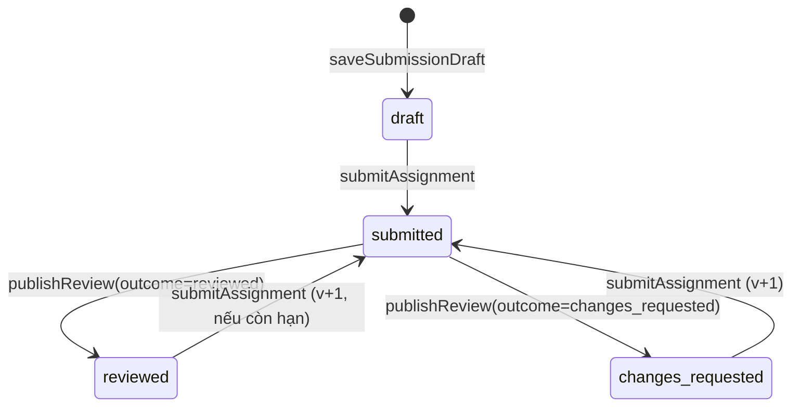
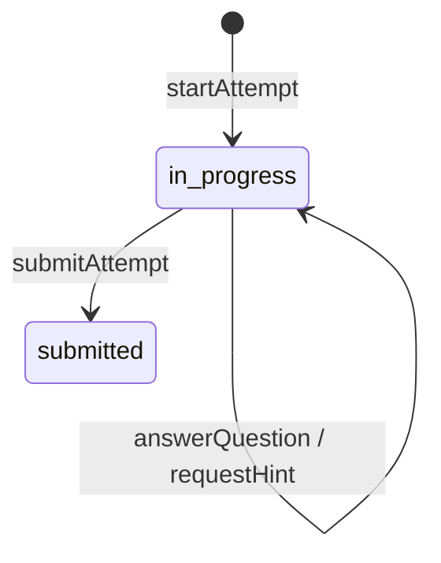

# 05 · Nghiệp vụ và lệnh ghi

Mỗi lệnh ghi là một use case trong `packages/domain`. Mục này là **đặc tả để code**: ai được làm, điều kiện, các bước trong giao dịch, sự kiện phát ra, lỗi, và ca kiểm thử bắt buộc. Đọc cùng docs/02 mục 5 (vòng đời request) và docs/06 (chấm, quan sát, R0).

Ký hiệu: **Khóa** = `SELECT … FOR UPDATE`; **Audit** = ghi `audit_log`; **Outbox** = ghi `outbox_events`. Mọi lệnh có Audit trừ khi ghi "không audit".

## 1 Sự kiện outbox

| event_type | Phát bởi | Payload (chỉ ID) | Consumer |
|---|---|---|---|
| `ReleaseCreated` | releaseModules | pathReleaseId, moduleReleaseIds, offeringId | notify (HS trong offering) |
| `SubmissionSubmitted` | submitAssignment | submissionId, submissionVersionId, learnerId, moduleReleaseId | notify (GV phân công, gộp theo giờ) |
| `QuestionAnswered` | answerQuestion, submitAttempt | responseIds, attemptId, learnerId, offeringId, purpose | insight.deriveObservations |
| `ReviewPublished` | publishReview | reviewId, submissionId, learnerId, offeringId, decisionIds | notify (HS, PH đã xác minh); insight.deriveObservations |
| `DecisionSuperseded` | supersedeDecision | decisionId, learnerId, offeringId | notify (HS) |
| `FileUploaded` | uploadFile | fileId | files.scan |
| `ObservationsAdded` | insight.deriveObservations (worker) | learnerId, offeringId, kcVersionIds | insight.recomputeNeeds, insight.updateMisconceptionSignals |
| `GuardianLinkRevoked` | revokeGuardianLink | linkId | platform.revokeGuardianSessionsCache (không có cache ở pilot: no-op) |

Consumer đánh dấu `processed_events(event_id, consumer)` trong cùng transaction với tác dụng của nó.

## 2 Ma trận quyền

`can(actor, action, facts)`; "phân công" = `teacher_assignments` còn hiệu lực có capability tương ứng; "ghi danh" = `offering_enrollments.status='active'`; "liên kết" = `guardian_links.status='verified'`.

| Hành động | admin | teacher | student | guardian |
|---|---|---|---|---|
| `org.manage` (offering, phân công, ghi danh, nhập tài khoản) | ✓ trong trường | ✗ | ✗ | ✗ |
| `guardian_link.verify/revoke` | ✓ trong trường | ✗ | ✗ | ✗ |
| `curriculum.read` | ✓ | ✓ | ✓ (YCCĐ của offering đã ghi danh) | ✓ (của con) |
| `curriculum.propose` | ✗ | ✓ | ✗ | ✗ |
| `curriculum.review` | có dòng `curriculum_reviewers` cho môn | như admin | ✗ | ✗ |
| `module.create/edit` | ✗ | chủ module hoặc collaborator editor; course có offering được phân công `author` | ✗ | ✗ |
| `module.publish` | ✗ | như edit | ✗ | ✗ |
| `release.create/change` | ✗ | phân công `release` cho offering | ✗ | ✗ |
| `release.read_learner` | ✗ | phân công bất kỳ (xem trước, không sinh tiến độ) | ghi danh + `available_from ≤ now` | ✗ |
| `progress.write` | ✗ | ✗ | chính mình, ghi danh | ✗ |
| `submission.draft/create` | ✗ | ✗ | chính mình, ghi danh, release mở | ✗ |
| `submission.read` | ✗ (M10: quyền hỗ trợ có lý do) | phân công `review` hoặc `view` | chính mình | ✗ nội dung; ✓ tiêu đề và trạng thái của con |
| `attempt.*` | ✗ | ✗ | chính mình | ✗ |
| `review.*` | ✗ | phân công `review` | ✗ | ✗ |
| `review.read_published` | ✗ | phân công | chính mình | liên kết |
| `decision.supersede` | ✗ | phân công `review` | ✗ | ✗ |
| `needs.read` | ✗ | phân công (có value) | chính mình (nhãn chữ) | ✗ |
| `heatmap.read` | ✗ | phân công | ✗ | ✗ |
| `family_support.*` | ✗ | ✗ | ✗ | liên kết |

Test: `packages/testkit/authz/matrix.ts` sinh ca cho mọi ô (cho phép và từ chối) trên dữ liệu hai trường, hai offering, hai HS, hai PH (docs/09 mục 4).

## 3 Tổ chức

### 3.1 importUsers

- **Quyền** `org.manage`. **Idempotency** có (scope `importUsers:<schoolId>`).
- **Input** CSV UTF-8, tối đa 2 000 dòng: `ho_ten, ma_dinh_danh, vai_tro (student|teacher|guardian), lop?, email?, ma_hs_con?` (với guardian).
- **Kiểm** trùng `ma_dinh_danh` trong tệp; vai trò hợp lệ; lớp tồn tại trong năm học hiện hành.
- **Các bước** theo lô 50 dòng: tạo người dùng Keycloak (mật khẩu tạm 12 ký tự, `requiredActions=[UPDATE_PASSWORD]`) → transaction: `users`, `school_memberships`, `class_memberships` (nếu có lớp), `guardian_links` pending (nếu guardian có `ma_hs_con`), Audit. Lỗi DB → xóa người dùng Keycloak vừa tạo.
- **Output** danh sách tạo được kèm mật khẩu tạm (chỉ trả một lần) và danh sách lỗi theo dòng. Không ghi mật khẩu vào log hay audit.
- **Test** tệp có dòng trùng; Keycloak lỗi giữa lô; chạy lại cùng key không tạo trùng.

### 3.2 createOffering, assignTeacher, enrollLearners

- `createOffering`: kiểm course và năm học thuộc trường; `code` duy nhất trong năm; tùy chọn tạo `offering_class_links`.
- `assignTeacher`: người được phân công có membership `teacher` active. EXCLUDE chặn phân công chồng thời gian → 409.
- `enrollLearners`: chỉ người có membership `student`; bỏ qua người đã ghi danh (trả `alreadyEnrolled`). Ghi danh lại HS đã `withdrawn`: cập nhật `status='active'`, xóa `withdrawn_at`, Audit với lý do.
- **Test** A01: GV dạy Tin10A1, Tin10A2, Toán10A3 chỉ thấy đúng ba offering; gọi trực tiếp API offering khác → 404.

### 3.3 Liên kết phụ huynh

- `createGuardianLink` (admin): tạo `pending`. Unique partial chặn trùng.
- `verifyGuardianLink`: pending → verified, ghi `verified_by/at`.
- `revokeGuardianLink`: verified/pending → revoked, lý do bắt buộc. Request tiếp theo của PH với con đó → 404 (AC03, A02).
- Máy trạng thái: `pending → verified → revoked`; `pending → revoked`. Không quay lại.

### 3.4 transferClass

- Đóng `class_memberships` hiện hành tại ngày D (`valid = [start, D)`), mở hàng mới `[D, end)`. Một transaction. Không đổi `offering_enrollments` và không chuyển bài nộp (A03).

## 4 Chương trình và KC

Dữ liệu chương trình dùng chung mọi trường (không có `school_id`). Quyền `curriculum.review` theo `curriculum_reviewers(user_id, subject_code)`; chỉ cấp bằng CLI `grant-reviewer` của người vận hành, không có API (quản trị một trường không được trao quyền thẩm định dùng chung). `curriculum.propose` cho mọi user có membership `teacher` active.

Quy tắc chung cho mọi lệnh duyệt:

- Người duyệt phải có `curriculum_reviewers` cho môn của đối tượng; với cạnh, cho **cả hai** môn ở hai đầu. Thiếu → 403.
- **Không tự duyệt**: người duyệt khác người đề xuất (`created_by`). Vi phạm → 422 `VALIDATION_FAILED`, `details.reason = "SELF_REVIEW"`. Dữ liệu `import` (seed) không có người đề xuất nên ai có quyền cũng duyệt được.
- Mỗi lần đổi trạng thái ghi một dòng `curriculum_review_log` (append-only) và audit trong cùng transaction.
- Chuyển trạng thái chỉ theo máy trạng thái; sai → 422. Đã ở trạng thái cuối (`approved`, `rejected`) thì không duyệt lại; muốn đổi thì đề xuất mới.

Lệnh:

- `reviewRequirement` (If-Match, revision = `updated_at` tính bằng micro giây): `unverified → source_checked → approved`, hoặc `unverified|source_checked → rejected`. Hàng `extraction = 'check'` bắt buộc `note` khi sang `source_checked`. `correctedText` chỉ khi đang `unverified` hoặc `source_checked`: cập nhật `text`, ghi `old_text`/`new_text` vào nhật ký. Không đổi `code791_stem`.
- `proposeKc`: tạo `knowledge_components` + `kc_versions(version_no=1, status='proposed', created_by)` + `requirement_kc_links(status='proposed')`. YCCĐ phải cùng môn, cùng lớp với KC và không ở `rejected`.
- `proposeKcVersion`: sửa nội dung = version mới `version_no+1`, `proposed`. Mỗi KC tối đa một version `proposed` → 409.
- `reviewKcVersion`:
  - `rejected`: chỉ đổi trạng thái.
  - `approved` khi KC chưa có version approved: đổi trạng thái; duyệt kèm các `requirement_kc_links` proposed của version này nếu người duyệt không bỏ.
  - `approved` khi đã có version approved cũ: trong **một transaction** version cũ → `superseded`; chép các cạnh approved chạm version cũ (trừ `dropEdgeIds`) sang version mới với `status='approved'`, `source` giữ nguyên, `rationale = 'carried from v<n>'`; chép liên kết YCCĐ approved (trừ `dropLinkIds`). Chép cạnh tạo chu trình → toàn bộ rollback, 422 `KC_EDGE_CYCLE`. Module đã publish vẫn trỏ version cũ (lịch sử bất biến).
- `proposeKcEdge`: hai đầu là version `approved` hoặc `proposed` (không superseded/rejected), `from ≠ to`. Trùng → 409.
- `reviewKcEdge`: trigger DB chặn chu trình (SQLSTATE 23514, thông điệp bắt đầu `KC_EDGE_CYCLE`) → 422 `KC_EDGE_CYCLE`, `details` gồm hai mã KC. Chỉ duyệt `approved` được khi cả hai đầu đã `approved`.
- `reviewRequirementKcLink`: đổi `status`, tùy chọn `coverage`.
- `proposeMisconception`, `reviewMisconception`: gắn một KC; chỉ `approved` dùng được trong câu hỏi (V04).

Đọc:

- Đồ thị dùng cho publish, R0, lộ trình và bản đồ nhiệt **chỉ** lấy từ view `effective_kc_edges` (cạnh approved, hai đầu approved). Repository không có hàm nào khác trả cạnh cho các nơi này (B04).
- `listKcEdges?status=proposed` và hàng đợi thẩm định chỉ cho người có `curriculum.propose` hoặc `curriculum.review`.
- HS và PH đọc YCCĐ qua offering; chỉ thấy YCCĐ `approved` hoặc `source_checked` (hàng `unverified` chỉ GV thấy, có nhãn "chưa thẩm định").

## 5 Soạn bài

### 5.0 Quy tắc chung của bản nháp (chốt ở 3.3)

- **Quyền `module.edit`**: chủ module; hoặc collaborator `editor`; hoặc GV có phân công `author` còn hiệu lực cho một offering cùng `course_id`. Quản lý collaborator chưa có ở M4 (bảng có sẵn, API để sau).
- **Phạm vi YCCĐ**: `requirementIds` (cấp module và cấp mục) phải thuộc cùng môn, cùng lớp với course và có `review_status` `approved` hoặc `source_checked`; YCCĐ `unverified`/`rejected` → 422 khi lưu.
- **Trường do server sở hữu** (client gửi lên thì 422, INV-01): `source` của câu hỏi luôn là `teacher` khi lưu qua API; `approvedBy`; `provisional`. Câu `ai_proposal` chỉ vào bản nháp qua pipeline AI (M9+); test V07 dùng dữ liệu chèn trực tiếp.
- **KC và lỗi hiểu sai**: `kcRequired`, `kcObservable`, `kcVersionId` của tiêu chí phải là KC version `approved` lúc lưu. Nếu sau đó version bị `superseded`, bản nháp vẫn lưu được nhưng `validate` báo V05 và Studio đề nghị "Cập nhật lên version mới" (đổi id, người soạn xác nhận). Lỗi hiểu sai gắn phương án phải `approved` và `misconceptions.kc_id` trùng `kc_id` của một KC observable của câu.
- **Chẩn đoán tiên quyết**: quiz `purpose = 'diagnostic'` được quan sát KC là tiên quyết trực tiếp (trong `effective_kc_edges`, loại `prerequisite`) của KC trong phạm vi, kể cả KC ngoài lớp như Toán 6, Toán 9 (docs/06 mục 6, V05). Mục khác thì không.
- **Rich text**: chỉ JSON `hcn-rich/1` (docs/03 mục 4.2), không có HTML. Server kiểm bằng zod `.strict()`, giới hạn độ dài (đoạn ≤ 5 000 ký tự, code ≤ 20 000, math ≤ 1 000), link chỉ `https:` (URL parse lại, từ chối `javascript:`, `data:`, `vbscript:`, ký tự điều khiển). Khối `image` → 422 `FEATURE_NOT_ENABLED` cho tới M5 (cần `files`).
- **Hiển thị**: React render từng khối; không `dangerouslySetInnerHTML` ngoại trừ đầu ra `katex.renderToString(expr, { throwOnError: false, trust: false, strict: 'warn', maxSize: 10, maxExpand: 100 })`. Code block hiển thị dạng văn bản, không chạy.
- **Digest**: sha256 hex của payload sau khi bỏ mọi `clientKey`, chuẩn hóa theo RFC 8785 (JCS). Cùng nội dung → cùng digest bất kể thứ tự khóa.

### 5.1 createModule

- **Quyền** teacher có phân công `author` cho một offering thuộc `courseId`.
- Tạo `modules`, `module_drafts(revision=1, payload = {schema, title, requirementIds, items: []})`.

### 5.2 saveModuleDraft

- **Quyền** `module.edit`. **If-Match** bắt buộc.
- **Kiểm** payload theo zod `ModuleDraft` (docs/03 mục 4.1): tối đa 100 mục, 50 câu mỗi quiz, 10 tiêu chí mỗi rubric; rich text đúng khối cho phép; link `https://`; `kcObservable ⊆` KC version `approved`; lỗi hiểu sai `approved` và thuộc KC observable của câu.
- **Các bước** Khóa `module_drafts`; so revision → 409 `REVISION_CONFLICT` với `details.currentRevision`; UPDATE payload, `revision+1`. Không audit (nháp); ghi audit mỗi 30 phút một lần cho mỗi module (hoặc bỏ qua ở pilot).
- **Test** P1a-08: hai lần lưu cùng revision song song → một thành công, một 409; payload vẫn hợp lệ.

### 5.3 validateModuleDraft

- Gọi hàm thuần `computeCoverage(draft, requirements, kcLinks)` ở docs/06 mục 5; trả `CoverageReport`. Không ghi DB.

### 5.4 publishModuleVersion

- **Quyền** `module.publish`. **Idempotency** scope `publish:<moduleId>`.
- **Kiểm** `expectedRevision` = revision hiện tại; coverage không có lỗi `block` (V01, V05, V07) → nếu có: 422 `COVERAGE_BLOCKED` kèm cảnh báo; mọi cảnh báo `caution` có trong `acknowledgements` với lý do → nếu thiếu: 422 `VALIDATION_FAILED` `details.missingAcknowledgements`.
- **Các bước** (một transaction):
  1. Khóa `module_drafts`.
  2. `version_no = max + 1`.
  3. INSERT `module_versions` (title, description, requirement_ids, coverage_report, coverage_ack, digest = sha256 của payload chuẩn hóa loại bỏ `clientKey`).
  4. Với mỗi assignment có rubric: INSERT `rubric_versions`, `rubric_criteria`.
  5. INSERT `module_items` theo thứ tự.
  6. Với mỗi quiz: INSERT `assessment_versions`, `question_items`, `question_keys`, `question_kc_links`, `option_misconceptions`.
  7. Audit `module.publish`.
- **Output** `ModuleVersionSummary`.
- Publish không có thay đổi so với version trước (digest trùng) → vẫn tạo version mới? **Không**: trả 409 `ALREADY_PUBLISHED` kèm `details.versionNo` của version trùng digest.
- **Test** C01, C02, C07; P1a-02 (sửa nháp sau publish không đổi version đã publish); publish lại cùng key → cùng version; C10/AC08 ở mức version (rubric sửa trong nháp, publish v2, v1 và rubric_versions của v1 không đổi); A07 (sau publish, mọi hàng của v1 không UPDATE/DELETE được, kể cả bằng hcn_app).

### 5.5 Đọc

- `getModuleDraft` (có `answerKey`, `rationale`, `optionMisconceptions`) chỉ cho người có `module.edit`; người chỉ xem (phân công `view`) → 404.
- `previewModuleDraftAsLearner` dùng **đúng** hàm chiếu DTO học sinh sẽ dùng ở M5 (`toLearnerRelease`), có test snapshot chứng minh không chứa `answerKey`, `rationale`, `optionMisconceptions`, `kcRequired`. Không ghi tiến độ.
- `listMyModules`, `listModuleVersions` theo quyền trên.

## 6 Giao bài

### 6.0 Chốt ở 3.4 (M5)

- `releaseModules`: mọi `moduleVersionId` thuộc module có `course_id` trùng course của offering; người giao có phân công `release` còn hiệu lực. Lịch lưu UTC; web nhập theo `Asia/Ho_Chi_Minh`. `availableFrom` được phép ở quá khứ (giao ngay). Trả `ReleaseReceipt`. Idempotency lưu cả receipt (không có dữ liệu nhạy cảm).
- `changeSchedule`: chỉ đổi `due_at`, `accept_until`; `available_from` không đổi. Không kiểm lại bài đã nộp (giữ `is_late` cũ).
- `listReleases` (GV) và `getLearnerToday` (HS) đọc từ `module_releases`; HS chỉ thấy release của offering đang ghi danh `active` và `available_from ≤ now()`. Trước giờ mở → 404, không phải 403 (P1a-09).
- Outbox `ReleaseCreated`, `SubmissionSubmitted` chưa có consumer ở M5: worker đánh dấu `done` khi không có consumer đăng ký. Consumer thêm ở mốc sau đọc sự kiện mới; không phát lại sự kiện cũ (ghi rõ trong code của registry).

### 6.1 releaseModules

- **Quyền** `release.create` trên offering. **Idempotency** scope `release:<offeringId>`.
- **Kiểm** mỗi `moduleVersionId` thuộc module của course của offering; `dueAt > availableFrom`; `acceptUntil ≥ dueAt`; tối đa 20 module.
- **Các bước** INSERT `path_releases` + tất cả `module_releases` (position theo thứ tự) trong một transaction; Audit; Outbox `ReleaseCreated`.
- **Test** P1a-03: lỗi ở module thứ hai → không có hàng nào (kiểm DB); P1a-04: thử lại cùng key sau mất phản hồi → cùng receipt.

### 6.2 changeSchedule

- **Quyền** `release.change`. **If-Match** = `schedule_revision`.
- **Các bước** Khóa `module_releases`; INSERT `release_schedule_changes` (old/new, reason); UPDATE `due_at`, `accept_until`, `schedule_revision+1`. Nội dung không đổi. `available_from` không đổi sau khi đã mở.
- Bài đã nộp giữ `is_late` như lúc nộp; không tính lại.

## 7 Học tập

### 7.0 Chốt ở 3.4 (M5)

- **Cấu hình nộp bài** (`module_items.submission_config`, migration 0006): `{types: ["text"|"code"|"rich"…], allowFiles, maxFiles ≤ 10}`; NULL = `{types:["text"], allowFiles:true, maxFiles:10}`. ModuleDraft thêm trường tùy chọn `submission` cho assignment (packages/contracts); `publishModuleVersion` ghi vào cột này. Version đã publish trước 3.4 dùng mặc định. `saveSubmissionDraft` từ chối `body.type` ngoài `types` (422) và `fileIds` khi `allowFiles=false` hoặc vượt `maxFiles` (422).
- **Tệp của bài nộp**: `fileIds` phải có `owner_id` = HS, cùng trường; code hiện chặn tệp đã gắn bài nộp khác (`FILE_ATTACHED`), giữ nguyên. Khi nộp, mọi tệp phải `clean`; DB có trigger chặn thêm (0007, DB27). `pending` → 423 `FILE_NOT_SCANNED`; `infected` hoặc `error` → 422 `FILE_REJECTED` kèm `details.fileIds`, web yêu cầu tải lại tệp khác.
- **Tải lên**:
  - `@fastify/multipart` với `limits.fileSize = 25 MiB`, `files = 1`; tệp bị cắt (`truncated`) → xóa tệp tạm, 413. Caddy đặt `request_body max_size 26MB` cho `/api/v1/files`.
  - Loại tệp: `file-type` trên byte thật. Nếu `file-type` không nhận ra: chỉ chấp nhận khi đuôi `.txt` hoặc `.py`, nội dung UTF-8 hợp lệ và không có byte NUL → `text/plain` hoặc `text/x-python`. Đuôi và MIME phải khớp (ví dụ `.pdf` nhưng byte là ZIP → 415). Không nhận `.docm/.xlsm/.pptm`, SVG, HTML.
  - Tên lưu là UUID; `original_name` chỉ để hiển thị, cắt còn 200 ký tự, bỏ ký tự điều khiển và `/ \`.
  - Giới hạn 20 tệp/10 phút/người (docs/04 mục 5).
- **Quét ClamAV** (consumer `files.scan` của `FileUploaded`):
  - Gửi `INSTREAM` tới clamd, chunk 64 KiB, timeout 30 s. `OK` → `clean`; `FOUND` → `infected`; lỗi mạng hoặc timeout → ném lỗi để outbox thử lại theo lũy thừa; sau 3 lần của riêng consumer này → `error`.
  - `infected`: chuyển byte sang `FILE_STORAGE_DIR/.quarantine/<storage_key>` (không đổi `storage_key` trong DB; worker không có quyền sửa cột này), ghi audit `file.infected` (actor NULL, `details = {fileId, signature}`).
  - Không gửi tệp ra ngoài máy chủ (INV-14).
- **Tải xuống**:
  - Quyền: chủ tệp; GV có phân công `review` hoặc `view` với offering của một bài nộp có phiên bản chứa tệp; HS hoặc PH khi tệp nằm trong `content_files` của module version đã giao cho offering họ được xem. Không có quyền → 404.
  - Chỉ `clean`; `pending` → 423; `infected`/`error` → 404.
  - Header luôn có: `X-Content-Type-Options: nosniff`, `Content-Security-Policy: sandbox; default-src 'none'`, `Cache-Control: private, no-store`, `Content-Type` = `mime_detected`. `Content-Disposition: attachment; filename*=UTF-8''<tên mã hóa RFC 5987>`; riêng ảnh trong `content_files` dùng `inline`.
- **Ảnh trong nội dung** (bật khối `image` của `hcn-rich/1`): `fileId` phải là ảnh `clean` (png, jpeg, webp) cùng trường, do người soạn tải lên; `alt` bắt buộc. `publishModuleVersion` ghi `content_files(module_version_id, module_item_id, file_id, alt)` cho mọi ảnh trong version (0006); 0007 buộc ảnh `clean` và bất biến (DB28, DB29). Ảnh chưa `clean` lúc publish → 422 `VALIDATION_FAILED` `details.reason = "IMAGE_NOT_CLEAN"`.
- **Tiến độ**: `markViewed`/`selfMark` chỉ nhận POST từ HS có ghi danh; GV xem trước, PH xem, GET, prefetch không ghi (P1a-07).
- **Nháp bài làm**: server là nguồn sự thật; không lưu nội dung bài vào `localStorage`/`sessionStorage`. Web giữ trong bộ nhớ, tự lưu sau 2 giây ngừng gõ, thử lại theo lũy thừa khi mất mạng, cảnh báo `beforeunload` khi còn thay đổi chưa lưu. Chỉ hiện "Đã lưu lúc HH:mm" sau 200 (A05).
- **Worker**:
  - Vòng lặp: `SELECT … FROM outbox_events WHERE status='pending' AND available_at ≤ now() ORDER BY id FOR UPDATE SKIP LOCKED LIMIT 20`, mỗi sự kiện một transaction. Consumer idempotent qua `processed_events(event_id, consumer)`.
  - Lỗi → `attempts+1`, `available_at = now() + least(2^attempts × 5 s, 1 h)`, `last_error` (không chứa nội dung bài). `attempts ≥ 8` → `dead`, metric `outbox_dead` tăng.
  - Job dọn dẹp mỗi giờ: xóa `idempotency_keys` quá 7 ngày, `sessions` hết hạn quá 1 ngày (quyền cấp ở 0006). Không xóa tệp ở pilot.
  - Nhiều tiến trình worker chạy song song không xử lý trùng (test hai worker cùng lúc).

### 7.1 markViewed, selfMark

- **Quyền** `progress.write`; mục thuộc release; release đã mở.
- Chỉ POST tạo tiến độ; GET/prefetch/GV xem trước/PH xem không bao giờ ghi (P1a-07).
- `view` chỉ cho mục có `completion_rule='view'`; `self_mark` chỉ cho `self_mark`. Sai loại → 422.
- Upsert `activity_progress(status='completed', source_event, completed_at=now())`; lần sau giữ nguyên `completed_at`. Không audit (khối lượng lớn); ghi metric.

### 7.2 saveSubmissionDraft

- **Quyền** `submission.draft`. **If-Match** = `draft_revision` (lần đầu `W/"0"`).
- Tạo `submissions` nếu chưa có (status `draft`). Khóa hàng; so revision; UPDATE `draft_body`, `draft_revision+1`, `draft_updated_at`. Không audit.
- `fileIds` phải thuộc người nộp, cùng trường, chưa gắn bài khác.
- Web chỉ hiện "Đã lưu lúc HH:mm" khi nhận 200 (A05).

### 7.3 uploadFile

- **Quyền** người dùng đã đăng nhập có membership.
- Stream vào thư mục tạm, tính sha256 và kích thước; > 25 MiB → hủy, 413.
- Phát hiện MIME bằng `file-type` trên byte thật. Allowlist: `application/pdf`, `image/png`, `image/jpeg`, `image/webp`, `text/plain`, `text/x-python` (đuôi `.py`, nội dung UTF-8), `application/vnd.openxmlformats-officedocument.wordprocessingml.document`, `application/vnd.openxmlformats-officedocument.spreadsheetml.sheet`, `application/vnd.openxmlformats-officedocument.presentationml.presentation`, `application/zip` (chỉ khi môn Tin 12 và đuôi `.zip`, M10). Ngoài danh sách → 415.
- Di chuyển vào `FILE_STORAGE_DIR/<school_id>/<yyyy>/<mm>/<uuid>`; INSERT `files(scan_status='pending')`; Outbox `FileUploaded`.
- Worker quét ClamAV: `clean` / `infected` (chuyển vào thư mục cách ly, ghi audit) / `error` (thử lại 3 lần).
- Tải xuống: kiểm quyền với bài nộp hoặc chủ sở hữu; chỉ `clean`; header `Content-Disposition: attachment`, `X-Content-Type-Options: nosniff`, `Content-Security-Policy: sandbox`.

### 7.4 submitAssignment

- **Quyền** `submission.create`. **Idempotency** scope `submit:<releaseId>:<itemId>`.
- **Kiểm**
  - mục là `assignment`, release thuộc offering HS đang ghi danh, `available_from ≤ now`;
  - `now ≤ accept_until` nếu có; nếu `now > due_at` và `late_policy='reject'` → 410 `RELEASE_CLOSED`;
  - `draftRevision` = `submissions.draft_revision` hiện tại → khác: 409 `REVISION_CONFLICT` (A05: không nộp nhầm revision);
  - mọi tệp `clean` → có `pending`: 423 `FILE_NOT_SCANNED`; có `infected`: 422.
- **Các bước**
  1. Khóa `submissions`.
  2. `version_no = current_version_no + 1`; INSERT `submission_versions` (body = draft_body, `content_hash` = sha256 canonical, `is_late = due_at IS NOT NULL AND now > due_at`, `submitted_at = now()` của DB).
  3. INSERT `submission_version_files`.
  4. UPDATE `submissions`: `current_version_no`, `status='submitted'`.
  5. Upsert `activity_progress` completed (rule `submit`, `source_event='submission:<id>'`).
  6. Audit `submission.submit`; Outbox `SubmissionSubmitted`.
- **Output** `SubmissionReceipt` với thời điểm server.
- **Test** AC05 (hai request đồng thời cùng key → một phiên bản), AC06 (commit rồi mất phản hồi → gửi lại trả cùng receipt), nộp lại tạo v2 và giữ review v1, A13 tệp lỗi.

## 8 Quiz

### 8.0 Chốt ở 3.5, khớp code M6 (79d1c56)

- **Lượt làm**: `startAttempt` có Idempotency (scope `start:<releaseId>:<itemId>`), trả 201 cả khi nối lại lượt `in_progress` của cùng (HS, release, assessment). `max_attempts` NULL: diagnostic, exit_ticket hiểu là 1; practice, self_assessment, summative không giới hạn. Khóa hàng `quiz_attempts` (FOR UPDATE) trong mọi lệnh ghi của lượt để tránh trùng `try_no`.
- **Trả lời** (`answerQuestion`, Idempotency-Key bắt buộc, scope `answer:<attemptId>:<questionId>`): gửi lại do mạng chập chờn không được tăng `try_no` (trọng số practice phụ thuộc lần thử).
  - practice: `try_no = max + 1` trong khóa lượt; câu đã đúng → 409 `ALREADY_ANSWERED` (`details.reason = ALREADY_CORRECT`); lượt đã nộp → `SUBMITTED`.
  - mục đích khác: được trả lời lại trước khi nộp; mỗi lần là một hàng mới (`try_no` tăng); khi nộp **chỉ hàng cuối** của mỗi câu được chấm và sinh quan sát.
  - `response` đúng một dạng theo qtype (zod `.strict()`); sai dạng hoặc trường lạ (`correct`, `score`…) → 422 (C08). Số không phân tích được → 422 kèm thông điệp docs/06 mục 1, không lưu hàng (A14, INV-12).
  - **"Em chưa học phần này"** (B05): `response = {"notLearned": true}`, hợp lệ ở mọi mục đích trừ practice (practice → 422 reason `NOT_LEARNED`); lưu `correct = NULL`; không sinh quan sát; tính 0 vào `score` nhưng vẫn tính vào `max_score`; báo cáo GV đếm riêng.
  - `hints_used` của hàng = giá trị `attempt_hint_usage` tại lúc trả lời.
- **Gợi ý** (`requestHint`, không cần Idempotency-Key): chỉ practice có `hints_enabled`, câu chưa đúng; tối đa số gợi ý của câu (≤ 3); hết → 409 `ALREADY_ANSWERED` reason `NO_MORE_HINTS`; không phải practice → reason `HINTS_DISABLED`; câu đã đúng → reason `ALREADY_CORRECT`.
- **Phản hồi cho HS**:
  - practice: luôn trả `correct` ngay (kể cả `show_feedback = never`); sai và phương án có lỗi hiểu sai `approved` → `feedback` là mô tả lỗi; **không bao giờ** trả đáp án đúng hay `rationale` (code M6 chưa trả `rationale`; giữ vậy).
  - diagnostic: không bao giờ trả đáp án đúng (giữ ngân hàng câu dùng lại); sau khi nộp chỉ trả `score/maxScore` nếu `show_feedback ≠ 'never'`.
  - mục đích khác practice: `never` không lộ; `immediate` lộ đúng/sai ngay; `after_submit` sau nộp; `after_due` khi đã nộp, release có `due_at` và đã quá hạn (không có hạn thì không lộ). Code M6 không trả `correctAnswer` ở bất kỳ trường hợp nào; giữ vậy tới khi có yêu cầu từ GV.
  - Mọi đường ra (JSON, HTML, source map, cache) có test không chứa khóa (SEC-08, A04, C09).
- **Nộp lượt**: điểm câu theo docs/06 mục 2 (multi_choice `partial` cho điểm lẻ, `correct = (điểm = 1)`); `score` = tổng điểm hàng cuối của từng câu, làm tròn 3 chữ số; `max_score` = số câu; `submitted_at` lấy `Meta.clock` của server. Tiến độ `completed` bất kể điểm (P1a-05). Không ghi `attainment_decisions` (P1a-10, AC09).
- **Outbox**: `QuestionAnswered` (practice: mỗi lần trả lời; mục đích khác: khi nộp, chỉ hàng cuối; payload `responseIds` là chuỗi id nối bằng dấu phẩy). Chưa có consumer ở M6, worker đánh dấu `done`; M8 thêm consumer **và** job backfill đọc thẳng `question_responses` (idempotent theo `source_ref`) để không mất dữ liệu phát sinh trước M8.
- **Giới hạn** 60 request/phút/HS cho `answerQuestion`, `requestHint` (docs/04 mục 5).
- **Không có** đồng hồ đếm giờ, bảng xếp hạng, ô chat tự do (B13: màn quiz không có ô nhập văn bản nào ngoài ô trả lời của câu `numeric`/`short_text`).
- `min_score`, KC gate cho điều kiện mở mục → 422 `FEATURE_NOT_ENABLED` (P1a-06).

Quy tắc chấm, chuẩn hóa số, trọng số ở docs/06.

### 8.1 startAttempt

- **Quyền** `attempt.create`; mục là quiz; release mở.
- `attempt_no = số lượt + 1`; nếu `max_attempts` và đã đủ → 409 `ATTEMPT_LIMIT_REACHED`. Diagnostic, exit_ticket mặc định `max_attempts=1`.
- Nếu còn lượt `in_progress` cho cùng assessment → trả lượt đó (không tạo mới).
- `option_order` đóng băng khi `shuffle_options`.
- **Output** `Attempt` với `LearnerQuestion[]` (không khóa).

### 8.2 answerQuestion

- **Quyền** chủ lượt; lượt `in_progress`.
- **Kiểm** câu thuộc assessment của lượt; body chỉ chứa `response` (zod `.strict()`), mọi trường khác → 422 (C08); số không phân tích được → 422 `VALIDATION_FAILED` (INV-12).
- **try_no**
  - practice: `try_no = số lần trả lời câu này + 1`; nếu câu đã đúng → 409 `ALREADY_ANSWERED_CORRECTLY` (dùng mã `VALIDATION_FAILED` với `details.reason`).
  - diagnostic, exit_ticket, summative: chỉ `try_no = 1`; trả lời lại trước khi submit → ghi đè bằng hàng mới `try_no = n+1` nhưng chỉ hàng cuối được chấm khi submit.
- **Chấm** gọi `gradeResponse(qtype, answerKey, response)` (đọc `question_keys` trong use case, không đưa ra DTO); xác định `misconception_id` từ `option_misconceptions` khi sai.
- **Các bước** INSERT `question_responses` (correct, hints_used hiện tại của câu, misconception_id); Outbox `QuestionAnswered` (practice: ngay; mục đích khác: khi submit).
- **Output** practice: `revealed=true`, `correct`, `feedback` = mô tả lỗi hiểu sai nếu có, không lộ đáp án đúng khi chưa đúng; mục đích khác: `revealed=false` trừ khi `show_feedback='immediate'`.
- **Test** C03, C04, C08, C09; A14 (số rỗng, sai locale).

### 8.3 requestHint

- Chỉ practice và `hints_enabled`; trả gợi ý bậc tiếp theo; tăng bộ đếm gợi ý của câu trong lượt (lưu ở bảng nhỏ `attempt_hint_usage` hoặc cột JSON của attempt — thêm migration ở M5). Hết gợi ý → 409.

### 8.4 submitAttempt

- **Idempotency**. Khóa lượt; đã `submitted` → trả kết quả cũ.
- Tính `score` = số câu có câu trả lời cuối đúng (practice: số câu đã đúng); `max_score` = số câu.
- UPDATE `status='submitted'`, `submitted_at`; upsert `activity_progress` completed (**bất kể điểm**, P1a-05); Outbox `QuestionAnswered` cho mục đích không phải practice.
- Không ghi `attainment_decisions` (P1a-10, AC09).

## 9 Đánh giá

### 9.0 Chốt ở 3.6 (M7)

- **Hàng chờ** (`getReviewQueue`): bài nộp có phiên bản hiện hành chưa có review `published`, trong các offering GV có phân công `review`; sắp theo `submitted_at` tăng dần, phân trang con trỏ `(submitted_at, id)`; lọc theo mục, trạng thái muộn. Không trả nội dung bài trong danh sách.
- **Bản nháp review**: mỗi phiên bản bài nộp một nháp (UNIQUE sẵn có). Mọi GV có phân công `review` với offering đều sửa được; `reviewer_id` = người lưu gần nhất; công bố ghi người công bố vào audit. HS không bao giờ đọc được nháp.
- **Công bố** (`publishReview`, body `{expectedRevision, expectedSubmissionVersionId, outcome, decisions: [{requirementId, decision, reason?}]}`):
  - thứ tự khóa: `submissions` → `reviews` → `pg_advisory_xact_lock(hashtextextended(learner||offering||requirement, 0))` cho từng YCCĐ có quyết định, theo thứ tự `requirementId` tăng dần để tránh deadlock;
  - quyết định mới nối vào quyết định hiện hành (`attainment_current`) của (HS, offering, YCCĐ); lỗi UNIQUE (hai gốc, hai nhánh) → 409 `REVISION_CONFLICT` kèm `details.reason = "DECISION_CHANGED"`;
  - `decisions` rỗng → không có hàng `attainment_decisions` (C06); `reason` bắt buộc khi đã có quyết định hiện hành;
  - DB chặn quyết định dựa trên review của HS khác hoặc offering khác (0008, DB34).
- **Thay quyết định** (`supersedeDecision`): quyết định đích phải hiện hành (không → 409 `REVISION_CONFLICT`); `reviewId` là review `published` của chính HS trong cùng offering; `reason` ≥ 5 ký tự.
- **Hồ sơ** (`getLearnerRecords`): ba lớp riêng (docs/06 mục 7) cho một offering; mỗi lớp kèm "cập nhật lúc…". HS xem của mình; GV có phân công bất kỳ; PH qua liên kết `verified`. Người khác → 404 (B09).
- **Cổng PH**: `listMyChildren`, `getChildOverview` chỉ trả dữ liệu đã công bố: tiến độ, review `published` (nhận xét chung và mức từng tiêu chí), quyết định hiện hành, việc sắp đến hạn. Không có nháp, không có nội dung bài làm, không có `needs` (HCN22-05). Liên kết bị thu hồi → 404 ngay request sau (A02).
- **Đồng hành gia đình**: `commitFamilySupport` (≤ 500 ký tự, gắn một offering của con), `cancelFamilySupport`; DB chỉ cho `committed → cancelled` (DB36).
- **Thông báo** (consumer `notify`, bảng `notifications`, UNIQUE `(recipient_id, source_event)`):
  - `ReleaseCreated` → HS ghi danh active của offering; `ReviewPublished` → HS và PH `verified`; `DecisionSuperseded` → HS và PH `verified`;
  - `due_soon`: job mỗi giờ, cho HS chưa nộp mục `submit` có `due_at` trong 24 giờ tới; `source_event = uuid v5(namespace cố định trong code, "due_soon:<releaseId>:<itemId>:<learnerId>")` để chạy lại không trùng;
  - payload chỉ `{title, href}`; không nhận xét, không điểm; `markNotificationRead` chỉ đổi `read_at` (DB37).
  - Sự kiện M5/M6 đã `done` không phát lại (thông báo cũ không cần bù).
- **Worker an toàn khi sập** (A08, AC11): mỗi consumer ghi `processed_events` trong cùng transaction với tác dụng của nó; test giết worker sau commit và trước khi đánh dấu outbox `done` rồi chạy lại → không trùng thông báo.

### 9.1 openReview

- **Quyền** `review.create` trên offering của bài nộp.
- Nếu đã có review `draft` cho `submission_version_id` → trả nó; ngược lại INSERT (revision 1). `isCurrentVersion` = version này là `current_version_no`.

### 9.2 saveReviewDraft

- **If-Match**. Lưu `comment`, `review_criterion_results` (upsert theo tiêu chí). Tiêu chí phải thuộc `rubric_version_id` của review. Không audit.

### 9.3 publishReview

- **Quyền** `review.publish`. **Idempotency** scope `publishReview:<reviewId>`.
- **Kiểm**
  - `expectedRevision` khớp → 409 `REVISION_CONFLICT`;
  - `expectedSubmissionVersionId` = `review.submission_version_id` **và** là phiên bản hiện hành của bài nộp → khác: 409 `SUBMISSION_VERSION_CHANGED` với `details.currentSubmissionVersionId` (AC07, A06);
  - mọi tiêu chí của rubric có `level` (kể cả `not_shown`) → thiếu: 422;
  - mỗi `decisions[].requirementId` thuộc `requirement_ids` của mục assignment (nếu rỗng thì của module version).
- **Các bước**
  1. Khóa `submissions` rồi `reviews`.
  2. UPDATE review: `status='published'`, `outcome`, `published_at`.
  3. UPDATE `submissions.status` = `reviewed` hoặc `changes_requested`.
  4. Với mỗi decision: tìm quyết định hiện hành (`attainment_current`) cho (learner, offering, requirement); INSERT `attainment_decisions` với `supersedes_id` = id đó (nếu có), `reason`, `review_id`.
  5. Audit `review.publish` (không lưu nội dung nhận xét trong details); Outbox `ReviewPublished`.
- **Output** `PublishedReview`.
- **Test** AC10, C06 (không chọn decision → không có hàng mới), DB09 kiểm ở DB, hai GV công bố song song cho cùng bài → một thành công, một 409.

### 9.4 supersedeDecision

- **Quyền** phân công `review`. Decision đích phải là hiện hành (không bị thay) → khác: 409.
- INSERT decision mới `supersedes_id`, `reason` bắt buộc, `review_id` = review đã công bố của cùng bài nộp hoặc bài nộp khác cùng YCCĐ. Outbox `DecisionSuperseded`.

## 10 Gia đình

- `commitFamilySupport`: quyền `family_support.*`; `content` ≤ 500 ký tự; không đổi tiến độ hay mức đạt của HS (test khẳng định bảng `activity_progress`, `attainment_decisions` không đổi).
- `cancelFamilySupport`: `committed → cancelled`, giữ lịch sử.

## 11 Worker

### 11.0 Chốt ở 3.7 (M8)

- Worker kết nối bằng `WORKER_DATABASE_URL` của login role thuộc nhóm `hcn_worker`; API không bao giờ ghi `observations`, `needs_estimates`, `misconception_signals` (0009 thu hồi quyền của `hcn_app`, DB39).
- `insight.updateMisconceptionSignals`: với mỗi hàng `question_responses` có `misconception_id`, đếm số **câu khác nhau** (`question_item_id`) của cùng (HS, offering, lỗi hiểu sai): 1 → `seen_once`, ≥ 2 → `signal` (C03); `evidence_response_ids` là các hàng đó. Trạng thái `resolved` chỉ do GV đặt (M10); M8 không tự chuyển.
- Tắt AI (`FEATURE_AI=false`, mặc định ở pilot): không có đường mã nào gọi LLM; luồng học, chấm, R0 chạy bình thường (A18, B10). R0 là quy tắc xác định, không phải AI sinh.
- `getLearnerNeeds`: GV có phân công thấy `status`, `value`, `nObservations`, `computedAt`; HS thấy của mình chỉ nhãn chữ (không `value`); PH và người khác → 404 (B08). Ước lượng không bao giờ tạo hay đổi `attainment_decisions` (B03).

| Consumer | Hành vi | Idempotency |
|---|---|---|
| `notify` | Tạo `notifications` cho người nhận; payload chỉ tiêu đề và đường dẫn; không nội dung nhận xét | UNIQUE (recipient_id, source_event) |
| `files.scan` | Gọi clamd `INSTREAM`; cập nhật `scan_status` | Cập nhật có điều kiện `WHERE scan_status='pending'` |
| `insight.deriveObservations` | Từ response hoặc review tạo `observations` theo docs/06 mục 3; phát `ObservationsAdded` | UNIQUE (source_ref, kc_version_id) + `ON CONFLICT DO NOTHING` |
| `insight.recomputeNeeds` | Với mỗi KC trong payload: đọc toàn bộ quan sát, gọi `r0Estimate` (docs/06 mục 4), INSERT `needs_estimates` nếu trạng thái hoặc value đổi | Kết quả xác định từ dữ liệu; chạy lại cho cùng giá trị thì bỏ qua |
| `insight.updateMisconceptionSignals` | Đếm số câu khác nhau có response gắn cùng lỗi hiểu sai; ≥ 2 → `signal` | Upsert theo UNIQUE |

Vòng lặp worker: mỗi 1 giây lấy tối đa 20 sự kiện `status='pending' AND available_at ≤ now()` `FOR UPDATE SKIP LOCKED`; xử lý từng consumer trong transaction riêng; lỗi → `attempts+1`, `available_at = now() + 2^attempts giây` (tối đa 1 giờ); sau 8 lần → `dead`, metric `outbox_dead` tăng, cảnh báo vận hành.

Job định kỳ (cron trong worker): dọn phiên hết hạn, idempotency > 7 ngày, outbox `done` > 30 ngày (02:00 hằng ngày); nhắc hạn nộp `due_soon` 24 giờ trước (mỗi giờ).

## 12 Máy trạng thái

Review: `draft → published` (không quay lại). Liên kết PH: `pending → verified → revoked`, `pending → revoked`. KC version và YCCĐ: `proposed/unverified → approved | rejected`; version mới thay version cũ bằng `superseded`.
