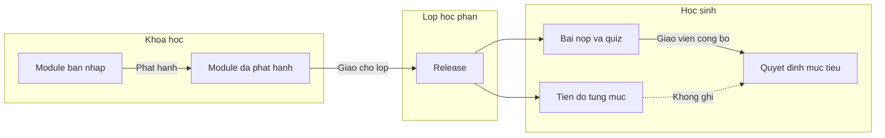

# Kiến trúc module bài học theo cách của Canvas

Tài liệu này chỉ mô tả kiến trúc. Chưa có mã, chưa đổi dữ liệu đang chạy.

Mốc: 29/09/2026. Phạm vi: một trường, lớp 10A1, khóa Tin học 10. Tham chiếu hành vi là **Modules** của Canvas LMS. Mô hình học vẫn là Học cùng nhau: hoàn thành một mục trong module và được xác nhận đạt mục tiêu là hai việc khác nhau.

## 1. Canvas đang làm gì

Trong Canvas, một khóa học có nhiều **module**. Mỗi module là một danh sách có thứ tự, không phải một bài viết dài. Giáo viên thêm vào module các mục thuộc loại khác nhau, rồi khóa đường đi của học sinh bằng ngày mở, module tiên quyết và yêu cầu hoàn thành.

Học sinh thấy một trang danh sách. Module thu gọn hoặc mở ra. Mục đã xong có dấu kiểm. Mục chưa đủ điều kiện thì khóa, kèm một câu nói rõ vì sao. Không có một nút “điểm năng lực” trên trang này.

| Thành phần Canvas | Việc nó làm |
|---|---|
| Module | Hộp có tên, thứ tự, trạng thái xuất bản |
| Module item | Một dòng trong hộp: trang, bài tập, quiz, tệp, liên kết, hoặc dòng tiêu đề |
| Prerequisite | Module này chỉ mở sau khi các module được chỉ định đã hoàn thành |
| Unlock date | Trước mốc thời gian thì cả module còn khóa |
| Sequential progress | Trong module, phải xong mục trước rồi mới mở mục sau |
| Completion requirement | Từng mục có thể yêu cầu xem, tự đánh dấu, nộp bài, hoặc đạt điểm tối thiểu |
| Requirement policy | Xong mọi yêu cầu, hoặc chỉ cần xong một yêu cầu, thì module được tính là hoàn thành |
| Publish | Module hoặc từng mục có thể ẩn với học sinh |

Canvas cho phép thảo luận, tệp, công cụ LTI và sổ điểm. Những phần đó không thuộc lát cắt này.

## 2. Ánh xạ sang Học cùng nhau

Giữ nguyên các khái niệm đã chốt trong đặc tả 2.0. Module kiểu Canvas là **cách xếp đường đi**, không thay hồ sơ mục tiêu.

| Canvas | Học cùng nhau | Ghi chú |
|---|---|---|
| Course | Khóa học | Tin học 10 |
| Module | Module bài học | Có phiên bản nháp và phiên bản đã phát hành |
| Module item | Mục trong module | Trỏ tới một hoạt động hoặc chỉ là tiêu đề |
| Assignment | Hoạt động thực hành | Nộp bài, có biên nhận |
| Quiz | Hoạt động luyện tập | Chấm ở server; không tự ghi mục tiêu đạt |
| Page | Hoạt động khám phá hoặc trang đọc | Có thể yêu cầu “đã xem” hoặc “tự đánh dấu” |
| Subheader | Tiêu đề nhóm | Không hoàn thành, không khóa người học |
| Prerequisite module | Module tiên quyết | Chỉ trỏ tới module cùng khóa, bản đã phát hành |
| Student progress | Tiến độ hoạt động | Không ghi quyết định mức đạt |
| Gradebook | Hồ sơ mục tiêu | Chỉ đổi khi giáo viên công bố nhận xét |

**Release** vẫn là lần giao một bản nội dung cho một lớp học phần. Học sinh của 10A1 không đọc bản nháp. Họ đọc snapshot đã gắn vào release. Sửa nháp sau đó không đổi đường đi đang học, trừ khi giáo viên phát hành phiên bản mới và giao lại.

## 3. Những gì không lấy từ Canvas

- Không dùng điểm quiz hay “score at least” để ghi **đã xác nhận mục tiêu**. Điểm luyện tập chỉ mở mục tiếp theo nếu giáo viên chọn yêu cầu đó.
- Không có diễn đàn, sổ điểm phần trăm, LTI, SCORM.
- Không cho học sinh tự bỏ một mục bắt buộc.
- Không gộp nhiều lớp học phần thành một thanh tiến độ.
- Phụ huynh thấy tiến độ hoạt động và phản hồi đã công bố. Phụ huynh không đánh dấu hoàn thành hộ con.
- Quản trị không soạn module và không sửa tiến độ.

## 4. Mô hình dữ liệu

Hai lớp: **bản soạn** trong khóa học, và **bản đã giao** trong release. Tiến độ của từng học sinh bám vào bản đã giao, không bám vào bản nháp.



### 4.1. Module bài học

| Trường | Ý nghĩa |
|---|---|
| id | Định danh module trong khóa |
| course_id | Khóa sở hữu |
| title | Tên học sinh nhìn thấy, ví dụ “Tuần 1 · Rẽ nhánh” |
| position | Thứ tự trên trang danh sách |
| summary | Một đoạn ngắn, có thể trống |
| status | `draft`, `published`, `archived` |
| version | Tăng khi phát hành. Bản đã phát hành không sửa tại chỗ |
| unlock_at | Mốc mở, theo giờ trường. Trống nghĩa là không khóa theo ngày |
| require_sequential | Đúng thì các mục có yêu cầu phải đi lần lượt |
| requirement_policy | `all` hoặc `one` |
| prerequisite_ids | Danh sách module cùng khóa phải hoàn thành trước |
| published_at | Lúc phát hành snapshot |

Phát hành tạo một snapshot bất biến: danh sách mục, thứ tự, yêu cầu, tiên quyết. Bản nháp tiếp theo là bản sao để sửa, không ghi đè snapshot cũ.

### 4.2. Mục trong module

| Trường | Ý nghĩa |
|---|---|
| id | Định danh mục trong snapshot |
| module_version_id | Thuộc snapshot nào |
| position | Thứ tự từ trên xuống |
| indent | `0` hoặc `1`. Mức 1 là mục nằm dưới một tiêu đề nhóm |
| item_type | Xem bảng loại mục |
| title | Nhãn trên danh sách. Có thể khác tên nội dung gốc |
| content_ref | Trỏ tới trang, hoạt động, quiz hoặc URL. Tiêu đề nhóm thì trống |
| completion | Yêu cầu hoàn thành, hoặc `none` |
| min_score | Chỉ dùng khi completion là `min_score` |
| published | Mục ẩn không hiện với học sinh và không chặn đường đi |

Loại mục của lát cắt đầu:

| item_type | Học sinh làm gì | Yêu cầu hợp lệ |
|---|---|---|
| `header` | Chỉ đọc dòng nhóm | Không có yêu cầu |
| `page` | Đọc một trang | `none`, `view`, `self_mark` |
| `assignment` | Viết bài và nộp | `none`, `view`, `submit` |
| `quiz` | Làm luyện tập trên server | `none`, `view`, `submit`, `min_score` |
| `link` | Mở URL ngoài | `none`, `view` |

`file`, thảo luận và LTI để sau. Khi thêm, chúng là loại mục mới, không nhét vào `page`.

Yêu cầu `view` hoàn thành khi học sinh mở đúng mục và server ghi nhận lượt xem. `self_mark` là nút “Đánh dấu đã xem”, chỉ có trên trang đọc. `submit` hoàn thành khi có biên nhận nộp bài hoặc một lần nộp quiz thành công. `min_score` hoàn thành khi điểm luyện tập đạt ngưỡng; lần làm chưa đạt không khóa vĩnh viễn nếu còn lượt.

### 4.3. Tiến độ

Tiến độ là bản ghi theo học sinh và snapshot đã giao.

| Bản ghi | Khóa | Trạng thái |
|---|---|---|
| Tiến độ mục | learner + release + item | `locked`, `available`, `completed` |
| Tiến độ module | learner + release + module | `locked`, `available`, `started`, `completed` |

`completed_at` và lý do hoàn thành (`view`, `self_mark`, `submit`, `min_score`) nằm trên tiến độ mục. Không suy ra trạng thái này từ hồ sơ mục tiêu.

Module `completed` khi:

- policy `all`: mọi mục đang xuất bản và có yêu cầu đều `completed`;
- policy `one`: ít nhất một mục như vậy `completed`.

Mục `header` và mục `completion = none` không tham gia điều kiện. Module không có mục nào mang yêu cầu thì không tự coi là đã hoàn thành; trạng thái ở `available` để khỏi hiện dấu kiểm giả.

## 5. Quy tắc mở khóa

Tính trên server mỗi lần học sinh mở danh sách hoặc một mục. Giao diện không tự mở khóa.

Một mục `available` chỉ khi tất cả điều kiện sau đúng:

1. Module và mục đã xuất bản trong snapshot của release.
2. `unlock_at` trống hoặc đã tới giờ, theo múi giờ trường.
3. Mọi module trong `prerequisite_ids` của học sinh này đang `completed`.
4. Nếu module bật `require_sequential`, mọi mục đứng trước có yêu cầu hoàn thành đã `completed`.
5. Release còn nhận việc. Release đã đóng thì vẫn cho đọc mục đã mở, nhưng không cho nộp mới.

Nếu thiếu một điều kiện, mục là `locked` và API trả một lý do duy nhất, theo thứ tự trên. Câu hiển thị đi kèm lý do, không chỉ đổi màu.

| Mã lý do | Câu học sinh thấy |
|---|---|
| `unpublished` | Mục này chưa được giao |
| `before_unlock` | Mở vào {thời điểm} |
| `prerequisite` | Cần hoàn thành module “{tên}” trước |
| `sequence` | Cần hoàn thành mục phía trên trước |
| `release_closed` | Lớp học phần không còn nhận bài mới |

Giáo viên và quản trị khi xem thử với tư cách học sinh vẫn chịu cùng quy tắc, trên một tiến độ xem thử tách khỏi học sinh thật. Giáo viên khi soạn thì thấy cả mục khóa và mục ẩn.

## 6. Luồng theo vai trò

### Giáo viên

Trang **Module** của khóa, giống trang Modules của Canvas:

1. Danh sách module theo `position`. Mỗi module một khối, kéo để đổi thứ tự.
2. Trong khối, danh sách mục. Kéo để đổi thứ tự. Thụt vào một cấp dưới tiêu đề nhóm.
3. Thêm module. Thêm mục: tiêu đề nhóm, trang, thực hành, luyện tập, liên kết.
4. Trên từng mục có yêu cầu hoàn thành. Trên module có ngày mở, tiên quyết, đi lần lượt, và “xong tất cả” hoặc “xong một”.
5. Công tắc xuất bản từng mục và cả module. Mục ẩn trong module đã xuất bản vẫn không hiện với học sinh.
6. **Phát hành** tạo snapshot. **Giao cho lớp** gắn snapshot vào release của 10A1, có ngày mở và hạn nộp của lớp. Hạn nộp của bài thực hành thuộc release, không đổi khi học sinh đánh dấu kế hoạch tuần.

Sửa một snapshot đã giao là không được. Muốn đổi đường đi thì phát hành phiên bản mới rồi giao lại. Bài đã nộp của snapshot cũ giữ nguyên.

### Học sinh

Trang **Khóa học** trở thành danh sách module của release đang học.

- Khối module: tên, số mục đã xong trên số mục có yêu cầu, trạng thái khóa hoặc đang học.
- Mở khối: các mục theo thứ tự, icon theo loại, dấu kiểm nếu đã xong, dòng lý do nếu đang khóa.
- Mở một mục `available` thì vào đúng màn hiện có: trang đọc, bài thực hành, hoặc luyện tập.
- Cuối mục có “Mục tiếp theo” nếu mục đó đã mở. Không nhảy cóc qua mục khóa.
- Thanh tiến độ chỉ đếm hoạt động. Câu cố định cạnh thanh: “Việc đã xong chưa phải mục tiêu đã được xác nhận.”

### Phụ huynh

Đọc cùng danh sách, ở chế độ xem. Thấy mục đã xong, mục đang khóa và phản hồi đã công bố. Không có nút đánh dấu, không có nút nộp.

### Quản trị

Không có trang soạn module. Nhật ký ghi phát hành và giao cho lớp: ai, phiên bản nào, lớp học phần nào. Không ghi nội dung bài làm.

## 7. Bố cục trang

Desktop, chiều rộng nội dung như shell hiện tại.

```text
Module bài học                         [+ Thêm module]
┌ Tuần 1 · Rẽ nhánh            Đã phát hành · phiên bản 2 ┐
│  Mở 28/09 · đi lần lượt · xong tất cả các yêu cầu       │
│  1  Khám phá if–else          Trang      Đã xem         │
│  2  Phân loại điểm            Thực hành  Cần nộp bài    │
│  3  Luyện tập                 Quiz       Đạt ít nhất 2/3│
└─────────────────────────────────────────────────────────┘
┌ Tuần 2 · Vòng lặp            Bản nháp ┐
│  (chưa giao cho 10A1)                 │
└───────────────────────────────────────┘
```

Trang học sinh:

```text
Tin học 10 · 10A1
┌ Tuần 1 · Rẽ nhánh                         1/3 việc ┐
│  ✓  Khám phá if–else           Đã xem              │
│  →  Phân loại điểm             Đang làm            │
│  ○  Luyện tập                  Khóa · cần nộp bài  │
└────────────────────────────────────────────────────┘
┌ Tuần 2 · Vòng lặp                         Khóa ┐
│  Cần hoàn thành module “Tuần 1 · Rẽ nhánh” trước │
└──────────────────────────────────────────────────┘
```

Dấu kiểm luôn có chữ trạng thái cạnh nó.

## 8. Hợp đồng đọc, ở mức kiến trúc

Chưa phải mã API. Đây là các thao tác cần có khi triển khai.

| Thao tác | Ai | Kết quả |
|---|---|---|
| Liệt kê module của khóa | Giáo viên được soạn | Nháp và snapshot, có mục |
| Lưu thứ tự, yêu cầu, tiên quyết | Giáo viên | Chỉ ghi vào bản nháp |
| Phát hành | Giáo viên | Snapshot mới, bất biến |
| Giao snapshot cho lớp học phần | Giáo viên của lớp | Release trỏ tới snapshot |
| Liệt kê module của release | Học sinh, phụ huynh có liên kết, giáo viên lớp | Kèm tiến độ và lý do khóa của đúng người học |
| Mở một mục | Đúng người được xem | 403 hoặc lý do khóa nếu chưa `available`; nếu được thì trả nội dung và ghi `view` khi yêu cầu là xem |
| Đánh dấu đã xem | Học sinh | Chỉ khi yêu cầu là `self_mark` và mục đang `available` |
| Nộp bài hoặc nộp quiz | Học sinh | Luồng hiện có. Sau biên nhận, tiến độ mục chuyển `completed` nếu yêu cầu là `submit` hoặc đủ `min_score` |

Đáp án quiz không nằm trong danh sách module. Đáp án chỉ trả sau khi server chấm, như hiện tại.

Tiên quyết vòng tròn bị từ chối lúc lưu: A cần B và B cần A, kể cả vòng dài hơn. Một module không được làm tiên quyết của chính nó.

## 9. Quan hệ với bản đang chạy

Hiện tại cả khóa là một `ModuleDoc`: một phần khám phá, một bài thực hành, một quiz, một trạng thái nháp hoặc đã phát hành. Chưa có danh sách module, chưa có mục khóa, chưa có tiên quyết.

Khi được duyệt kiến trúc, bước triển khai đầu không viết lại bài nộp hay hồ sơ mục tiêu. Bước đó chỉ tách đường đi:

1. Dựng snapshot “Tuần 1 · Rẽ nhánh” từ nội dung đang phát hành, gồm ba mục: trang khám phá, bài thực hành, luyện tập.
2. Gắn snapshot đó vào lớp 10A1.
3. Trang khóa học của học sinh đọc danh sách này thay vì một bài viết cố định.
4. Nộp bài và chấm quiz vẫn dùng luồng hiện có. Thêm một việc: cập nhật tiến độ mục sau khi xem, tự đánh dấu, hoặc có biên nhận.
5. Giáo viên có trang danh sách module để thêm module thứ hai ở dạng nháp, mà chưa cần kéo-thả.

Kéo-thả, thụt lề và nhiều loại tệp là bước sau. Trước đó vẫn đổi thứ tự bằng nút Lên và Xuống, vì bàn phím phải làm được cùng việc.

## 10. Việc cần chốt trước khi code

1. Lát cắt đầu có đúng năm loại mục ở mục 4.2, hay chỉ cần trang, thực hành và luyện tập?
2. Module đầu của 10A1 có bật đi lần lượt hay để học sinh mở cả ba mục ngay?
3. Quiz có được dùng `min_score` để mở mục sau, hay chỉ cần đã nộp?
4. Một release có nhiều module, hay mỗi tuần là một release riêng? Đề xuất: một release của lớp trỏ tới cả danh sách module đã giao, mỗi module vẫn có `unlock_at` riêng.
